# Architecture (MVP, pre-product)

```
files (PDF/CSV/TXT)
   |  ingest/        bytes -> RawDocument (text, doc_type, sha256)
   v
 extraction/        RawDocument -> Invoice | RateConfirmation | BillOfLading   (swappable provider)
   |  extract_bundle -> ExtractedBundle (+ warnings)
   v
 rules/             ExtractedBundle -> Findings -> RecoveryResult (per perspective)
   v
 evidence/          documents + findings + calculations + DRAFT letter -> EvidencePacket (+ markdown)
   v
 api/ (FastAPI) and cli.py     thin adapters over pipeline.run_pipeline
```

Request path in the API (production foundation):

```
request -> BodySizeLimitMiddleware -> AuthenticatedRoute (API key -> tenant, BEFORE the body is parsed)
        -> persist Analysis(running) + raw docs via StorageProvider      [db/, storage/; tenant-scoped]
        -> sandbox worker process: ingest -> extract -> rules -> evidence  [sandbox/; time+memory bounded]
        -> mark Analysis succeeded|failed (+ result JSON)                  [tenant-scoped repository]
```

## Modules (`src/freight_recovery/`)
| Module | Responsibility |
|---|---|
| `models.py` | pydantic v2 domain types; money is `Decimal`; `Finding`, `RecoveryResult`, `EvidencePacket` |
| `config.py` | env-driven `Settings` (`FR_*`), secrets excluded from `repr`, `validate_for_production()` guard |
| `keys.py`, `auth.py` | API-key format/HMAC hashing; `AuthenticatedRoute` resolves the tenant from the key before the body is read (401 no key / 403 invalid) |
| `admin.py` | operator CLI: tenants and API keys (`python -m freight_recovery.admin`) |
| `db/` | SQLAlchemy 2 tables (`tables.py`), tenant-bound `AnalysisRepository` and unscoped `TenantAdminRepository` (`repository.py`), engine/session factories, Alembic migrations (`migrations/`, `migrate.py`) |
| `storage/` | `StorageProvider` interface: `LocalFilesystemStorage` (default), `S3Storage` stub behind two flags; tenant-prefixed keys built only from validated ids |
| `sandbox/` | `run_isolated` / `SandboxRunner`: one worker subprocess per job with wall-clock, memory, CPU and output limits and a clean environment; `targets.analyze` is the analysis job |
| `ingest/` | decode PDF (pdfplumber, lazy import) / CSV (flattened to `Key: Value`) / TXT; classify doc type; sha256 |
| `extraction/` | `ExtractionProvider` Protocol; `DeterministicStubProvider` (default, offline); `LLMExtractionProvider` placeholder; `extract_bundle` |
| `rules/` | `detention.py` (auditable calculation), `invoice_checks.py` (rate/fuel/accessorial/duplicate/total), `engine.py` (perspective totals) |
| `evidence/` | `letter.py` deterministic draft letter; `packet.py` assembles packet and markdown |
| `pipeline.py` | `run_pipeline(files, perspective)` - the single orchestration entry point |
| `api/main.py` | `create_app()` factory + `app`; authenticated routes, tenant-scoped persistence, gated docs; `cli.py` for local use (no auth/DB) |

## Key decisions
- **Provider interface, deterministic default.** The pipeline depends only on `ExtractionProvider`. The stub makes tests reproducible and offline; a hosted-model provider can be added without touching rules or evidence. Model output must be validated by pydantic and never trusted for arithmetic: **all money math is in `rules/`, in Decimal.**
- **Rules produce explainable findings.** Every finding carries rule id, amount, confidence, and a step-by-step calculation; uncertain ones set `needs_human_review`. Duplicates are removed before rate comparisons to avoid double counting.
- **Two perspectives, one engine.** Findings are directional (`overcharge` vs `underbilled`); the chosen perspective sums its direction and reports the rest as ignored.
- **Human in the loop.** Output is a draft packet; nothing is sent. Every packet carries a disclaimer.
- **Tenant isolation by construction.** The tenant comes only from the API key. `AnalysisRepository` is bound to one tenant at construction and every query filters on it; another tenant's id is a 404; storage keys carry the tenant prefix and are re-checked on read. PostgreSQL row-level security is the next layer of defense in depth.
- **Persistence behind a repository.** SQLAlchemy 2 + Alembic; SQLite locally/tests, PostgreSQL (RDS) in production. An `analyses` row is both the job record (queued/running/succeeded/failed) and the result, so an async worker can adopt it without a schema change. Money is stored as integer cents plus the exact packet JSON.
- **Bounded parsing.** Hostile input is parsed in a separate, resource-limited worker process, never in the API process. This is process isolation, not an OS sandbox; seccomp/read-only-rootfs/no-egress containment is a deployment-layer control (`deploy/aws.md`).
- **No queue yet.** Analyses run synchronously within the request (bounded by the worker pool and a 503 back-pressure); an async job queue is a next step for large documents.
- **Evidence integrity.** Original-bytes sha256 recorded per document.

## Forecasting (roadmap)
`forecast/` is an optional, future capability (not in the core flow): a `Forecaster` interface, a stdlib seasonal-naive/moving-average baseline (default, tested), and a lazily-imported `neuralforecast` backend behind the `[forecast]` extra, off by default and not validated (needs real multi-series data; often only ties baselines). No accuracy claims.

## Known gaps
Scanned-PDF OCR; multi-document/multi-stop loads; timezone-aware timestamps; contract/tariff-specific rules; carrier-specific charge codes; dispute deadlines and status tracking; integrations (TMS/EDI/carrier portals); payments/credit reconciliation; rate limiting, malware scanning, retention policy, an async job queue; and the external security audit / compliance sign-off. The project's research plan (eval set first, independent verifier, measured pass^k) lives in `technical/` and is not yet implemented here.

---

# Web platform (TypeScript, steps 1-2)

> Written by scriber for run `REQ-20261008-webapp-foundation` on 2026-10-08. **Pre-product, synthetic
> data only, never deployed.** The Python service above and the `webapp/` pilot dashboard are unchanged and
> still run on their own. Threat model and known gaps:
> [technical/web-platform-security.md](technical/web-platform-security.md).

## Overview

An npm-workspaces monorepo next to the Python service. `web/` is a React 19 + Vite SPA (React Router,
TanStack Query, Zustand, Tailwind). `api/` is Node 22 + Fastify 5 + Prisma 7 on PostgreSQL 16, with Zod
validation and Pino logs. `packages/shared/` (`@fr/shared`) holds the roles, the permission matrix,
canonical JSON, text safety and the DTO schemas; both sides import it. `infra/` is a Terraform skeleton for
AWS. Build-order steps 1 and 2 are implemented: authN (argon2id, access JWT plus a rotating refresh
cookie, TOTP MFA, lockout), RBAC across 8 roles, 3-layer tenant isolation, app hardening, a hash-chained
append-only audit trail, the claims list, the evidence-packet viewer and the approvals human gate.
Step 3 (import and export) is described in its own section below:
[Web platform: import and export (step 3)](#web-platform-import-and-export-step-3). Step 4 (Dev
dashboard, Recovery intelligence, tenant API keys and the evaluation tool) has its own section too:
[Web platform: Dev dashboard, Recovery intelligence and API keys (step 4)](#web-platform-dev-dashboard-recovery-intelligence-and-api-keys-step-4).
The TS port of the Python rules is a later step (step 5). There is no learned model and no LLM call. The seeded claims and packets come from
the Python CLI output on `tests/fixtures/` (synthetic).

## Module Structure

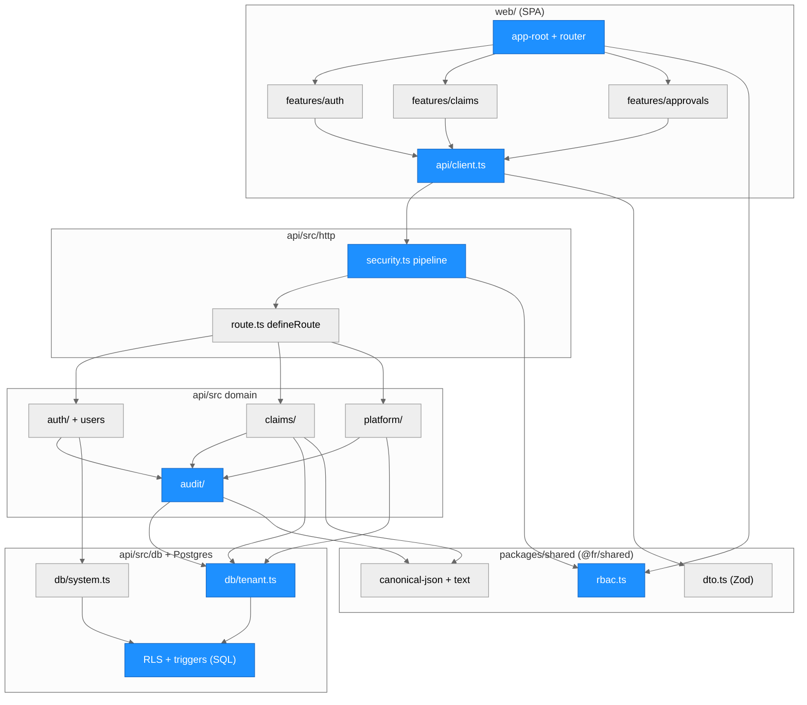

> Everything in this diagram is new in this run. Blue marks the security-critical modules.

### Module Reference

| Module / File | Layer | Purpose | Key Exports | Changed |
| --- | --- | --- | --- | --- |
| `packages/shared/src/rbac.ts` | Shared | **Single source of truth** for roles and the frozen permission matrix | `ROLES`, `PERMISSION_MATRIX`, `can`, `canAssignRole`, `canManageUserWithRole`, `MFA_REQUIRED_ROLES` | new |
| `packages/shared/src/dto.ts` | Shared | Strict request schemas and response DTOs (also `CLAIM_SORT_FIELDS`) | Zod schemas | new |
| `packages/shared/src/canonical-json.ts`, `text.ts`, `money.ts` | Shared | Canonical JSON for hashing; `displayText` and unsafe-character checks; integer-cent formatting | `canonicalJson`, `GENESIS_HASH`, `displayText`, `formatUsdCents` | new |
| `api/src/app.ts`, `server.ts`, `config.ts` | API | App factory; fail-safe config (production guards, secret checks) | `buildApp`, `loadConfig`, `secretEntropyProblem` | new |
| `api/src/http/security.ts` | API | One `onRequest` pipeline: rate limit → Origin → CSRF → authN → permission; security headers | `registerSecurityPipeline` | new |
| `api/src/http/route.ts` | API | `defineRoute`; the boot fails if a route lacks an access declaration; Zod validation in `preHandler` | `defineRoute` | new |
| `api/src/security/*` | API | argon2id, HS256 JWT (per-purpose key/typ/aud), TOTP, CSRF, HKDF/AES-GCM, lockout math | | new |
| `api/src/auth/*` | API | Login, MFA, refresh rotation + reuse detection, forgot/reset, invites, users (R3-R23), dev outbox (R38) | `authenticateAccessToken`, `rotateRefreshToken`, route registrars | new |
| `api/src/claims/*` | API | List/sort/search (`escapeLike`), packet viewer, content hash, review state machine, approvals (R26-R34) | `canTransition`, `packetContentHash` | new |
| `api/src/platform/*` | API | Health, tenant stats, SUPER_ADMIN cross-tenant read (audited first) | `crossTenantRead` | new |
| `api/src/audit/*` | API | Hash chain, append under an advisory lock, verifier, list/verify routes | `appendAudit`, `ChainVerifier` | new |
| `api/src/db/tenant.ts`, `system.ts` | Data | Layer-2 fail-closed tenant extension; system-mode transactions (restricted by lint) | `withTenantTx`, `withSystemTx` | new |
| `api/prisma/migrations/20261008000000_init/migration.sql`, `api/db/init/00-roles.sql` | Data | Schema, RLS + FORCE, least-privilege grants, append-only and state-machine triggers, DB roles | | new |
| `web/src/api/client.ts` | Web | Access token in memory, CSRF header, single-flight refresh (Web Locks across tabs) | `ApiClient` | new |
| `web/src/features/{auth,shell,claims,approvals}` | Web | Login/MFA/reset/invite pages, shell + command palette, claims table + detail sheet, approvals queue | pages | new |
| `infra/*.tf` | Infra | AWS skeleton (fmt/validate only, never applied) | | new |
| `compose.web.yml`, `.github/workflows/web-ci.yml` | Ops | Separate local stack and CI; the Python `docker-compose.yml` and `ci.yml` are untouched | | new |

## Request pipeline (data flow)

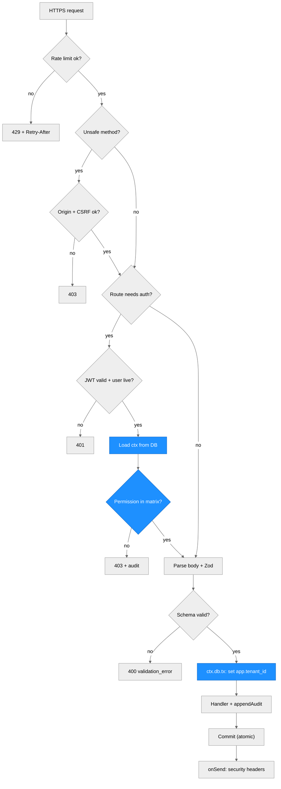

AuthN and authZ run in `onRequest`, before the body is parsed. An unauthenticated or forbidden request
therefore gets 401/403 even when its body is invalid. A business change and its audit event commit in
the same transaction: if the audit append fails, the request returns 500 and nothing changes.

## Authentication flows

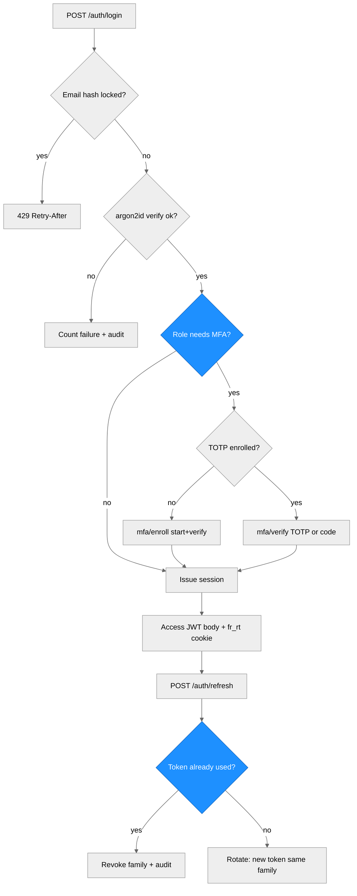

| Flow | Routes (under `/api/v1`) | Key rules |
| --- | --- | --- |
| Login | `POST /auth/login` | argon2id with a dummy verify for unknown or disabled users; per-email-hash lockout `min(30·2^(f-5), 900)` s after 5 failures; auth rate limit 20/60 s per IP |
| MFA | `/auth/mfa/verify`, `/auth/mfa/enroll/start`, `/auth/mfa/enroll/verify` | mandatory for OWNER, ADMIN, PLATFORM_DEV, SUPER_ADMIN; RFC 6238 ±1 step; accepted step strictly increasing (no replay); single-use recovery codes |
| Session | `/auth/refresh`, `/auth/logout`, `GET /me` | access JWT (10 min) is kept in JS memory; `fr_rt` cookie `HttpOnly; Secure; SameSite=Strict; Path=/api/v1/auth`; DB stores an HMAC of the token; reuse revokes the family; family max 30 days |
| CSRF | `GET /auth/csrf` | `fr_csrf` cookie == `X-CSRF-Token` == `nonce.HMAC(secret, nonce)`, plus an Origin check |
| Recovery | `/auth/forgot`, `/auth/reset`, `/auth/change-password` | same response for unknown emails; reset revokes all sessions; forgot limited to 5/15 min |
| Invites | `/users/invites`, `/auth/invites/inspect`, `/auth/invites/accept` | role assignment is rank-based (`canAssignRole`); OWNER is never assignable |

## RBAC

`packages/shared/src/rbac.ts` is the single source of truth. The API checks `can(role, permission)`
on every request. The web app imports the same frozen data only to hide controls.

| Permission | OWNER | ADMIN | MANAGER | REVIEWER | ANALYST | VIEWER | PLATFORM_DEV | SUPER_ADMIN |
| --- | --- | --- | --- | --- | --- | --- | --- | --- |
| `claims:read` | x | x | x | x | x | x | | |
| `claims:assign` | x | x | x | | | | | |
| `packets:edit`, `packets:approve` | x | x | x | x | | | | |
| `demands:send` | x | x | x | | | | | |
| `import:run` (step 3: batches, upload, documents, download, commit) | x | x | x | x | x | | | |
| `import:review` (step 3: review queue and decisions) | x | x | x | x | | | | |
| `export:claims` (step 3) | x | x | x | x | x | | | |
| `export:packets`, `export:outcomes` (step 3) | x | x | x | x | | | | |
| `users:read`, `users:manage`, `audit:read`, `settings:manage`, `integrations:manage` | x | x | | | | | | |
| `admins:manage`, `billing:manage`, `tenant:delete` | x | | | | | | | |
| `apikeys:manage` (step 4: create, list and revoke tenant API keys) | x | x | | | | | | |
| `platform:health` (step 4: also pipeline health and telemetry) | | | | | | | x | x |
| `platform:flags`, `platform:logs` | | | | | | | x | |
| `platform:eval` (step 4: evaluation runs) | | | | | | | x | |
| `platform:audit` (step 4: platform audit chain) | | | | | | | | x |
| `platform:tenants:list`, `platform:cross_tenant_read` | | | | | | | | x |

Platform roles have no tenant and no tenant data permission. A SUPER_ADMIN cross-tenant read is
read-only, needs a reason of at least 10 characters, and is audited into the target tenant's chain first.
There is no Team model, so every tenant role sees all claims of its tenant (assumption A4).

## Tenant isolation (three layers, fail closed)

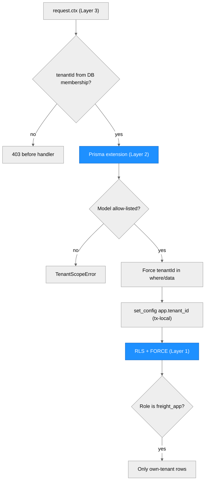

- **Layer 1, PostgreSQL RLS.** Every tenant-scoped table (`claims`, `evidence_packets`, the packet child
  tables, `approvals`, `memberships`, `invites`, `audit_events`) has `ENABLE` and `FORCE ROW LEVEL
  SECURITY` with `USING/WITH CHECK (tenant_id = fr_current_tenant())`. With no `app.tenant_id` set,
  queries see zero rows. Only `memberships` and `invites` also allow `fr_system_mode()` (auth bootstrap),
  and the `platform` audit chain is visible only in system mode.
- **Roles.** The API runs as `freight_app` (`NOSUPERUSER NOBYPASSRLS NOINHERIT`, not the owner; DML
  grants only; `evidence_packets` gets `UPDATE (status)` only; append-only tables get `SELECT, INSERT`
  only). `freight_owner` owns the schema and runs migrations, the seed and test fixtures (BYPASSRLS).
- **Layer 2, fail-closed Prisma extension** (`api/src/db/tenant.ts`). Models are allow-listed;
  `tenantId` is injected into every where clause and create, and a conflicting value throws. Raw SQL is
  blocked on the tenant client.
- **Layer 3, request context.** User, role, tenant status and refresh-family liveness are reloaded from
  the DB on every request, never from token claims. Platform users get `db = null`.

## Audit hash chain

- One chain per tenant (`chain_key = t:<tenantId>`) plus a `platform` chain.
  `hash_n = SHA-256(hash_{n-1} + "\n" + canonicalJson(event_n))`; genesis is 64 zeros; `seq` is contiguous
  under `pg_advisory_xact_lock(hashtextextended(chain_key, 0))`.
- Triggers block UPDATE, DELETE and TRUNCATE on `audit_events` (and on `approvals`, `login_attempts`
  and the packet child tables), even for the owner. Only `db:seed -- --reset` in dev/test bypasses them
  through `session_replication_role`.
- `GET /api/v1/audit/verify` (`audit:read`) recomputes the chain and reports `brokenAtSeq`. Metadata
  passes through a whitelist; failed logins are recorded with `actor = null`.

## Approval state machine

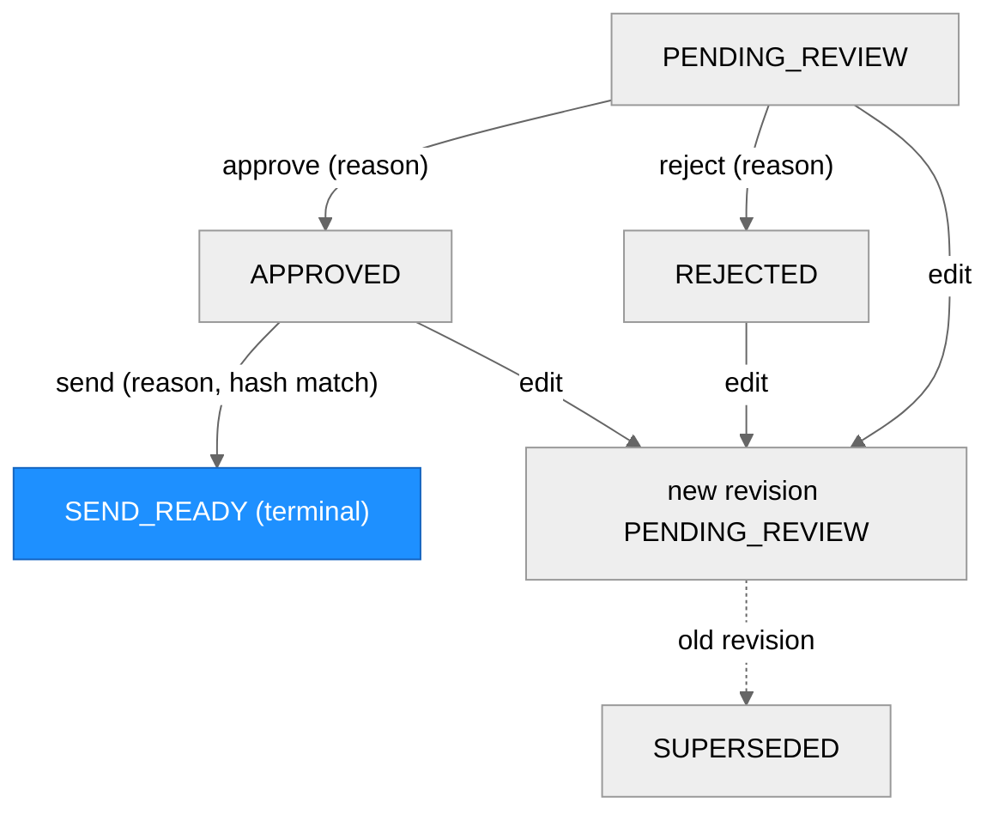

Every action needs a reason and writes an append-only `approvals` row plus an audit event in one
transaction, with the claim row locked `FOR UPDATE`. Approve records the packet's canonical content hash.
Send recomputes it and requires it to equal both the approval's hash and the stored hash. "Send" only
marks the demand send-ready: no email, no payment. The DB trigger `fr_packet_update_guard` enforces
the same transitions and makes every column except `status` immutable. Edit creates a new revision; the
approval row records the base revision (deviation 18).

| Function | Defined In | Called By | Purpose |
| --- | --- | --- | --- |
| `canTransition`, `targetStatus` | `api/src/claims/state-machine.ts` | claims service | transition table (mirrors the SQL trigger) |
| `packetContentHash` | `api/src/claims/content-hash.ts` | approve, edit, send, viewer integrity | canonical hash with ordinals instead of UUIDs |
| `lockClaimForUpdate` | `api/src/db/tenant.ts` | claims service | serializes concurrent decisions |
| `appendAudit` | `api/src/audit/audit.ts` | every mutating handler, cross-tenant read | chain append in the caller's transaction |
| `crossTenantRead` | `api/src/platform/cross-tenant.ts` | platform routes | audit first, then read, fail closed |

## AWS mapping (web stack)

`infra/` replaces `deploy/terraform/` **for the web stack only**. It follows the principles in
[deploy/aws.md](deploy/aws.md): secrets come from Secrets Manager through the task definition and are
never in state, migrations run as a one-shot ECS task before the rollout, the WAF sits in front, and
nothing is applied automatically.

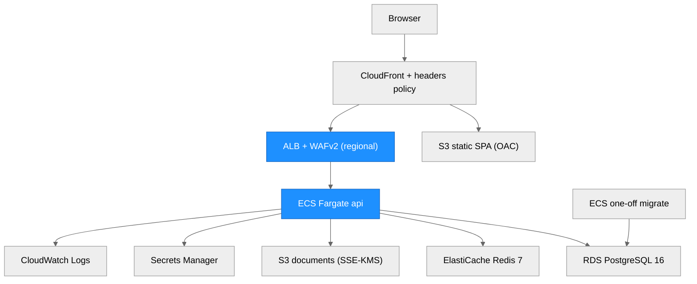

| Component | Local (`compose.web.yml`) | AWS (`infra/`) |
| --- | --- | --- |
| SPA | nginx-unprivileged, headers from `web/security-headers.json` | S3 + CloudFront (OAC), response-headers policy generated from the same JSON |
| API | `api` container (uid 10001, read-only root fs, caps dropped) | ECS Fargate, same hardening, private subnets, VPC endpoints (no NAT) |
| Edge | loopback only | ALB reachable only from CloudFront origin ranges, TLS 1.2/1.3 policy, WAFv2 (managed rules, IP rate limit, Content-Length > 64 KiB; step 3: the upload route has its own > 10 MiB rule) |
| DB | `postgres:16.15-alpine` + `00-roles.sql` | RDS PostgreSQL 16, KMS, `rds.force_ssl=1`, managed master password; roles applied by an operator |
| Rate-limit store | `redis:7-alpine` | ElastiCache Redis 7, TLS + at-rest encryption, AUTH token set out of band |
| Documents | MinIO (`chainguard/minio`) with built-in KMS (`fr-dev-key`) and versioning | S3 SSE-KMS (puts without the CMK are denied by bucket policy), versioning, lifecycle; task role limited to the `t/*` prefix, `s3:DeleteObject` only on `t/*/imports/*` |
| Secrets | public `local-dev-*` values (refused in production) | 7 Secrets Manager containers; values set out of band |

## Architectural Patterns

- **Security pipeline as one hook**: an exact, testable order (rate → Origin → CSRF → authN → authZ → validation).
- **Fail closed everywhere**: unknown routes refuse to boot; unset tenant means zero rows; an audit failure rolls back the business change; the production config refuses dev values.
- **Shared contract package**: roles, matrix and DTOs are defined once in `@fr/shared` and used by API and web.
- **Defense in depth in the database**: RLS, grants and triggers enforce the invariants even if application code is wrong.
- **Content-addressed approvals**: decisions bind to a canonical hash, not to a mutable row.

## Notes

- Deviations from the brief: Node 22 instead of 20 (Node 20 is EOL); a Prisma client extension instead of the removed `$use` middleware; eslint 9; framer-motion omitted. The full list (22 items) is in the run's `implementation.md`.
- Not verified: Docker images and the compose stack, Playwright e2e, any AWS deployment. See the threat model's "Known gaps".

---

# Web platform: import and export (step 3)

> Written by scriber for run `REQ-20261008-step3-import-export` on 2026-10-09 (branch
> `feat/import-export`). **Pre-product, synthetic data only, never deployed.** Threat rows for this step
> are T18-T31 in [technical/web-platform-security.md](technical/web-platform-security.md). The
> email-forward path is design only: [docs/design/email-ingest.md](docs/design/email-ingest.md).

## Overview (step 3)

Step 3 adds document **import** and **export**. Import covers upload, sniffing, encrypted storage,
sandboxed parsing, deterministic extraction with provenance, human review and commit to claims. Export
streams claims, packets and approval outcomes as CSV or XLSX, with formula neutralization. Step 3 does
not add OCR, AI or LLM calls, outbound email or email-forward ingestion. The parsing and extraction
logic is a TypeScript port of the Python `ingest/` and `extraction/` modules. Parity tests check it
against the Python code. Python is a test oracle only and never runs in production.

Main decisions:

- The pipeline is **synchronous** inside the upload request and bounded by timeouts. The status model
  already allows a queue later.
- The API **proxies** originals. There are no signed URLs.
- PDFs are read from the text layer only. Images are stored and flagged for manual entry.
- Claims created from imports start in the new status `AWAITING_ANALYSIS`, with no money and no packet.
  Step 5 adds the analysis.

## Module Structure (step 3)

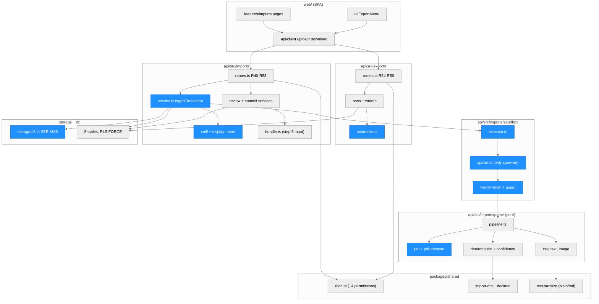

> Everything in this diagram is new or changed in step 3. Blue marks the modules that handle hostile
> bytes or hostile cell content.

### Module Reference (step 3)

| Module / File | Layer | Purpose | Key Exports | Changed |
| --- | --- | --- | --- | --- |
| `packages/shared/src/rbac.ts` | Shared | Adds `import:review`, `export:claims`, `export:packets`, `export:outcomes`; `import:run` now has routes | `PERMISSION_MATRIX`, `can` | changed |
| `packages/shared/src/import-dto.ts`, `import-fields.ts`, `extraction.ts` | Shared | Strict Zod DTOs for R40-R56, field keys and labels, reason codes, TS mirror of the Python `ExtractedBundle` | schemas, `FIELD_LABELS` | new |
| `packages/shared/src/decimal.ts` | Shared | Python-compatible `parseMoney`, integer micros, compare; no floating point | `parseMoney`, `toMicros`, `fromMicros`, `compareDecimal` | new |
| `packages/shared/src/text-sanitize.ts` | Shared | Port of `evidence/sanitize.py` with parity | `plain`, `md` | new |
| `api/src/imports/routes.ts` | API | R40-R53; raw `application/octet-stream` body on R43 only | `registerImportRoutes` | new |
| `api/src/imports/service.ts` | API | `ingestDocument` (single entry for upload and a future email worker), batch reads, stale reaper, verifying download stream | `ingestDocument`, `reapStale`, `prepareDownload`, `VerifyingStream` | new |
| `api/src/imports/sniff.ts`, `display-name.ts`, `body.ts` | API | Magic-byte sniffing and the extension rule; display-name sanitizing; bounded streaming body reader with idle timeout | `sniff`, `displayNameFor` | new |
| `api/src/imports/review-service.ts` | API | Confirm, correct or reject fields; add manual fields; set the type; accept or reject the document (row lock, decision row, audit) | `resolveField`, `addField`, `setDocType`, `acceptDocument`, `rejectDocument`, `reviewQueue` | new |
| `api/src/imports/commit-service.ts` | API | Groups accepted documents by normalized load number; creates or links claims (`AWAITING_ANALYSIS`) | `commitBatch`, `claimDocuments`, `normalizeLoadNumber` | new |
| `api/src/imports/bundle.ts` | API | Builds the TS `ExtractedBundle` from effective field values; citation locators (step 5 input) | `assembleBundle`, `loadBundleForClaim`, `pointerToLocator` | new |
| `api/src/imports/sandbox/executor.ts` | API | Semaphore, wall clock, output cap, RSS poll (Linux), exit-code mapping, strict response validation | `ChildProcessExecutor`, `ParseExecutor`, `ParserBusyError` | new |
| `api/src/imports/sandbox/spawn.ts` | API | The only `child_process` importer: fixed argv, `shell:false`, empty env, empty cwd, `--permission` | `startWorker`, `workerArgs`, `workerEnv` | new |
| `api/src/imports/sandbox/worker-main.ts`, `guard.ts`, `protocol.ts` | Worker | Worker entry (stdin to stdout); network and module guard preloaded with `--import`; versioned protocol | `validateWorkerResponse` | new |
| `api/src/imports/parse/*` | Parse | Pure port of `ingest/loader.py` and `extraction/stub.py`: text primitives, classification, CPython-compatible CSV and `strptime`, PDF text layer, PDF pre-scan, image structure checks, deterministic provider, confidence | `parseDocument`, `prescanPdf`, `ExtractionProvider`, `getProvider` | new |
| `api/src/exports/*` | API | R54-R56: count, `export.started`, keyset batches of 500, streaming CSV and XLSX (fflate), neutralization, `export.completed` / `export.aborted` | `registerExportRoutes`, `csvStream`, `xlsxStream`, `neutralizeFormula`, `cleanText`, `formatCents` | new |
| `api/src/storage/s3.ts` | Data | `putObject` (SHA-256 checksum, SSE-KMS), `headObject` verify, `getObjectStream`, `deleteObject`; every call checks the tenant prefix | `ObjectStore`, `tenantKey`, `isKeyInTenant` | changed |
| `api/src/db/claim-numbers.ts`, `claim-load-key.ts`, `import-locks.ts` | Data | `CLM-%04d` numbers under a tenant advisory lock; normalized load-number lookup; batch and document row locks | `nextClaimNumber` | new |
| `api/prisma/migrations/20261009000000_import_export/` | Data | 5 tenant tables, enums, CHECKs, RLS FORCE, column grants, immutability and append-only triggers, `AWAITING_ANALYSIS` | | new |
| `api/scripts/ensure-bucket.ts` | Ops | Creates the dev/CI bucket and enables versioning; refuses `NODE_ENV=production` | | new |
| `web/src/features/imports/*`, `web/src/components/ui/ExportMenu.tsx`, `web/src/api/client.ts` | Web | Import page, review queue, fields table, export menus, XHR upload with progress, blob download | pages, `ApiClient.upload`, `ApiClient.download` | new / changed |
| `tools/parity/extract_dump.py`, `sanitize_dump.py`, `api/test/parity/` | Test | Python oracle dumps and the parity comparison (registered divergences only) | | new |
| `infra/{s3,iam,ecs,waf,variables}.tf`, `compose.web.yml`, `.github/workflows/web-ci.yml` | Ops | Bucket deny rules and lifecycle, scoped `s3:DeleteObject`, ECS env, WAF upload exception, MinIO KMS and versioning, CI MinIO and build order | | changed |

## Import pipeline (data flow)

One upload is one `POST /api/v1/imports/:batchId/documents?filename=` request with the raw file bytes.
The pipeline runs synchronously, and the response carries the final document state.

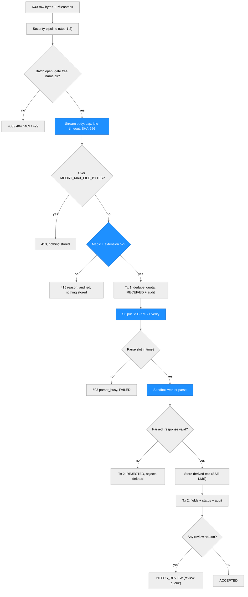

The steps in detail:

1. **Upload.** The client sends the raw bytes (`Content-Type: application/octet-stream`, no multipart).
   The file name is a query parameter and is sanitized into a display name. The client's media type is
   never used. Rate limit, Origin, CSRF, authentication and permission all run before the body is read.
2. **Sniff.** The API accepts `%PDF-` at offset 0, the PNG signature or `FF D8 FF`. Anything else is a
   text candidate. A text candidate must contain no NUL, C0 control or DEL byte other than HT, LF, CR
   and FF, and must not start like HTML, SVG, XML or PHP. Known non-allowed signatures are refused (zip,
   gzip, PE, ELF, GIF, RIFF, OLE, PostScript, rar, 7z). The last extension must be one of
   `.pdf .png .jpg .jpeg .csv .txt` and must agree with the sniffed type.
3. **Store.** Transaction 1 inserts the `RECEIVED` row and its audit event before any slow I/O. The
   original goes to `t/<tenantId>/imports/<batchId>/<docId>/original` with SSE-KMS and a SHA-256
   checksum. In production a `HEAD` request verifies the encryption. Keys never contain the client file
   name.
4. **Isolated parse worker.** `ChildProcessExecutor` takes a slot from a per-instance semaphore. It
   starts `node` with `--permission`, which grants read access to the worker files only. The worker gets
   no write, child-process, worker, addon or WASI permission. It also gets `--max-old-space-size`, an
   **empty environment** and an empty working directory. A best-effort, in-process guard module deletes
   `fetch`, `WebSocket`, `EventSource` and `XMLHttpRequest`, blocks the network, process and VM modules,
   and locks socket `connect` on the classes reachable from the stdio streams. It is not a security
   boundary: the real network control is a no-egress network (in AWS the no-NAT task network), and a
   dedicated no-egress parser task is a launch gate. The parent
   enforces the wall clock, the output cap and (on Linux) an RSS limit. The parent also treats the
   worker as untrusted. It re-validates the whole response (allowed keys, counts, pointer bounds,
   re-sanitized strings), and an invalid response becomes `parse_failed`.
5. **PDF pre-scan.** `pdf-prescan.ts` walks the PDF structure with fixed bounds before pdf.js sees the
   file. It rejects these as `malformed_pdf`: more than 3 chained filters, an indirect `/Filter`,
   decompression bombs (32 MiB per stream, 64 MiB in total), `/Prev` loops, more than 64 xref sections,
   page trees larger than the page count plus 16, and zero pages. It also counts the string operands of
   the content streams, including text drawn outside the page box, so the `PARSE_MAX_TEXT_CHARS` cap
   holds (`text_too_large`). pdf.js then reads the text layer only. It reads no annotations,
   attachments, JavaScript or XFA.
6. **Extraction with provenance.** The deterministic provider (`deterministic`, version 1) reads
   `Key: value` lines and produces allow-listed fields only. Every field has a source pointer (page,
   line, UTF-16 start and end, CSV row, sanitized excerpt) and a rule-based confidence. A field is
   flagged when its confidence is below `REVIEW_CONFIDENCE_THRESHOLD` (0.90), when its value is
   unparseable, or when duplicates conflict. PDF fields start at 0.85, so every PDF field is flagged by
   default.
7. **Review.** A document with any review reason is `NEEDS_REVIEW` and appears in the review queue
   (`GET /reviews`). A reviewer confirms, corrects or rejects each flagged field. For images the
   reviewer can also set the type and add manual fields. Then the reviewer accepts or rejects the
   document. Every action needs a reason. Each decision is an append-only `import_review_decisions` row
   plus an audit event. ACCEPTED documents are immutable.
8. **Commit.** `POST /imports/:batchId/commit` groups the batch's ACCEPTED documents by normalized load
   number (NFKC, whitespace collapsed, upper case). It then creates an `AWAITING_ANALYSIS` claim or links
   to an existing one. If the claim already has a packet, the documents are only linked
   (`new_evidence_not_in_packet`), and its packet and fields never change. The commit is atomic and
   idempotent.

### Function call graph (upload)

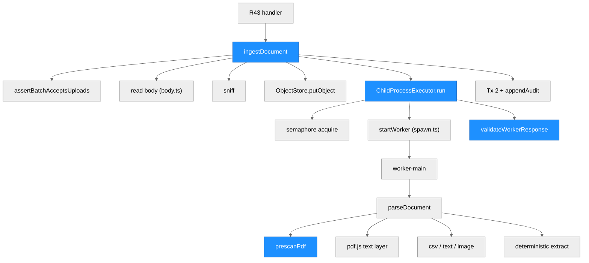

| Function | Defined In | Called By | Purpose |
| --- | --- | --- | --- |
| `ingestDocument` | `api/src/imports/service.ts` | R43 (later also an email worker) | the whole synchronous pipeline |
| `sniff` | `api/src/imports/sniff.ts` | `ingestDocument` | magic bytes, text gate, extension rule |
| `ChildProcessExecutor.run` | `api/src/imports/sandbox/executor.ts` | `ingestDocument` | slot, spawn, limits, outcome mapping |
| `startWorker` | `api/src/imports/sandbox/spawn.ts` | executor | the only process spawn in `api/src` |
| `parseDocument` | `api/src/imports/parse/pipeline.ts` | worker-main (and unit tests) | PDF/CSV/TXT/image to text, classify, extract |
| `prescanPdf` | `api/src/imports/parse/pdf-prescan.ts` | `pdf.ts` | bounded structural checks before pdf.js |
| `validateWorkerResponse` | `api/src/imports/sandbox/protocol.ts` | executor | strict re-validation of the worker output |
| `resolveField`, `acceptDocument` | `api/src/imports/review-service.ts` | R48, R49 | human review gate |
| `commitBatch` | `api/src/imports/commit-service.ts` | R52 | documents to claims under an advisory lock |
| `loadBundleForClaim` | `api/src/imports/bundle.ts` | step 5 (planned) | claim documents to `ExtractedBundle` |

## Document and field states

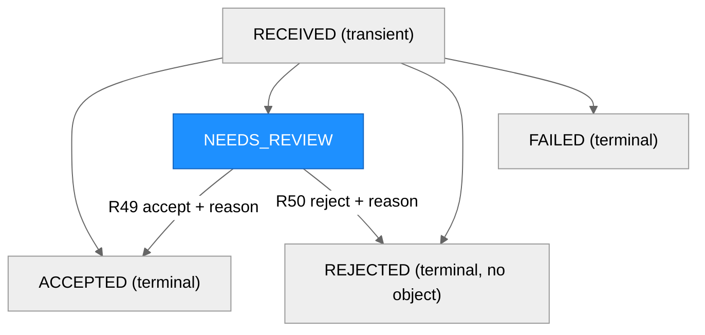

A field moves once from `PROPOSED` to `CONFIRMED`, `CORRECTED` or `REJECTED`. A BEFORE UPDATE trigger
enforces the transitions and keeps the extracted value, raw value, confidence and pointers immutable. A
`RECEIVED` document older than `IMPORT_STALE_SECONDS` becomes `FAILED` the next time its batch is read,
and its object is removed.

## Data model and storage

| Table | Purpose | Notable rules |
| --- | --- | --- |
| `import_batches` | one upload session (later also one email) | insert and select only |
| `import_documents` | one file: sniffed type, sha256, status, reasons, counts, `storage_key` | `UNIQUE (tenant_id, batch_id, sha256)`; `storage_key LIKE 't/<tenant_id>/%'`; identity columns immutable; status transitions enforced by trigger; no DELETE |
| `extracted_fields` | one field with value, raw value, confidence, pointer and review status | immutable except status and correction; one live field per key (partial unique index) |
| `import_review_decisions` | every reviewer decision, with the reason and value hashes (never values) | append-only |
| `claim_documents` | links a document to at most one claim | insert-only |

All five tables have `ENABLE` and `FORCE ROW LEVEL SECURITY` with the tenant policy and column-level
grants for `freight_app`. They are allow-listed in `TENANT_MODELS`. Object storage is private.
Originals and derived text live under `t/<tenantId>/imports/<batchId>/<docId>/{original,text}`. Every
`ObjectStore` call re-checks the tenant prefix, and the API never returns a storage URL.
`GET .../original` streams the object through the API under a synthesized file name. It verifies the
SHA-256 of the streamed bytes and aborts on a mismatch.

## Export streaming

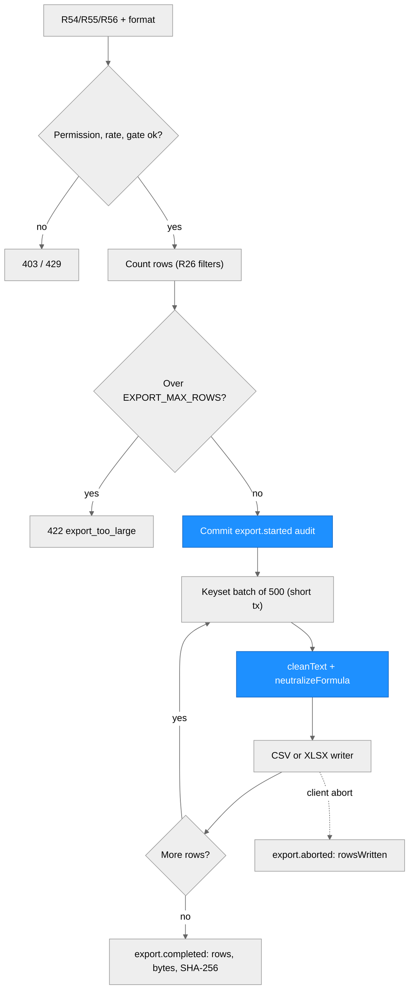

- **Formats.** CSV is UTF-8 with a BOM and CRLF, and every text cell is quoted. XLSX is one sheet,
  written as a streaming ZIP by `fflate`. It has typed strings and numbers and a bold, frozen header. It
  has no formulas, links, macros, drawings or external relationships.
- **Formula neutralization.** Text cells lose C0/C1 controls and bidi and zero-width characters. Tab,
  CR, LF, LS and PS become one space. Cells are capped at 10,000 characters. If the first
  non-whitespace character is `=`, `+`, `-`, `@` or a full-width form (U+FF1D, U+FF0B, U+FF0D, U+FF20),
  the cell gets a leading `'`. Numbers are written as numbers and are never neutralized.
- **Bounded memory.** Each batch of 500 rows uses its own short transaction, so no transaction stays
  open while the client reads. The writers honour backpressure.
- **Content.** Exports contain no user names, emails or ids. The claim assignee is excluded, and so is
  the demand letter text. Money is USD with two decimals, computed with integer arithmetic.
  `Invoice Date` is `YYYY-MM-DD`; timestamps are ISO-8601 UTC.

## Python parity: registered divergences (D1-D8)

The TypeScript parser must match the Python reference (`ingest_bytes`, `classify`,
`DeterministicStubProvider.extract`) for the supported subset. `api/test/parity/extract.parity.test.ts`
runs the Python code through `tools/parity/extract_dump.py`. It covers the fixture corpus, a generated
corpus and generated text-layer PDFs, and compares document type, sha256, text and fields. The
divergences below are the **only** allowed differences. Any other difference is a defect.

| ID | Divergence (TS vs Python) | Rationale |
| --- | --- | --- |
| D1 | PDF magic `%PDF-` must be at offset 0. Python tolerates up to 1024 junk bytes before it. | Leading junk is a classic polyglot trick (one file that is both a PDF and something else). Offset 0 makes the sniffed type unambiguous. |
| D2 | PDF text comes from pdf.js, not pdfplumber. Parity is claimed only for simple text-layer PDFs: one text line per line, standard Helvetica or Times, single column. | pdfplumber is Python-only, and the TS port must not call Python at runtime. Two engines order and space text differently on complex layouts. |
| D3 | The extension and the sniffed content type must agree. Allowed extensions: `.pdf .png .jpg .jpeg .csv .txt` (case-insensitive, last extension only). Python dispatches on the extension alone. | Stops a PDF or script disguised as `.csv` (and the reverse) from reaching the wrong parser. |
| D4 | Invalid UTF-8 is decoded with U+FFFD, as in Python, but adds the warning and review reason `DECODE_REPLACEMENTS`. A NUL byte, a C0 control byte other than HT, LF, CR and FF, **or DEL (0x7F)** rejects the file as `binary_content`. Python would continue. | Binary content in a "text" file signals a disguised or corrupted file. The DEL rule was added in fix round 1 (leader ruling SQ2). Python has no binary gate, so DEL has no Python counterpart. |
| D5 | Text longer than `PARSE_MAX_TEXT_CHARS` (default 2,000,000) is rejected as `text_too_large`. Python's cap is 5,000,000. For PDFs the cap also counts text drawn outside the page box (fix round 1 pre-scan). | A smaller bound on parser memory and time. |
| D6 | String values lose unsafe characters (controls, line separators, bidi controls) and are capped at 200 characters. The field gets reason `SANITIZED_VALUE` when anything changed. | Extracted strings are shown in the UI and exported, so they must be safe, single-line text. |
| D7 | Non-ASCII digits and exotic Unicode case folding are refused where Python's regexes would accept them. Date and time digits are ASCII `0-9` only, and the `USD` suffix matches ASCII letters only. | Stops look-alike digits and letters from changing amounts or dates. |
| D8 | PNG and JPEG are accepted and structurally validated but yield **no fields** (no OCR). The status is `NEEDS_REVIEW` with reason `IMAGE_NO_TEXT_LAYER`. A reviewer may set the type (R46) and enter fields (R47). | Python does not read images, and OCR is out of scope for step 3. |

Related notes (not new divergences):

- **Money format** (leader ruling SQ1): `parseMoney` keeps CPython parity, so `"1,2,3"` parses as `123`
  and `"$-5"` as `-5`. Step 5 may make money parsing stricter. That change would be registered as a new
  divergence.
- **PDF pre-scan** (fix round 1): the pre-scan refuses bombs, filter chains longer than 3, an indirect
  `/Filter`, `/Prev` loops and oversized page trees before pdf.js runs. These hostile PDFs lie outside
  the D2 parity subset.
- **PNG trailing bytes** (fix round 1): up to 16 zero bytes after `IEND` are tolerated, the same rule as
  for JPEG. Images have no Python counterpart (D8).
- **`strptime` edge case**: parity follows CPython 3.12 for a leading space before `%H` or `%d`. CPython
  3.14 differs. The corpus avoids that case, and both versions show zero differences.
- **Field order** (ruling SQ4): fields are ordered by the N7 key order, then by `groupIndex`.

## Interfaces for step 5 (rules and evidence port)

Step 5 ports the Python rules and evidence generation to TypeScript, with parity tests. It plugs into
these step 3 interfaces:

1. **Input.** `loadBundleForClaim(tx, claimId)` returns `{bundle, sources}`. `bundle` is the TS
   `ExtractedBundle`, built from the effective field values of the claim's linked documents. It is the
   input of the future `analyze(bundle, perspective, settings) -> Packet`. The Python counterpart is
   `run_pipeline` after `extract_bundle`.
2. **Provenance.** `pointerToLocator(displayName, pointer)` produces citation locators such as
   `invoice.txt:L5`, or `file.pdf:p2:L14` for PDFs. The seed already uses this convention. `sources[]`
   carries `documentId`, `displayName`, `sha256` and `docType` for `PacketSource`.
3. **Money.** `packages/shared/src/decimal.ts` is the base for money and hours arithmetic. Step 5 adds
   quantizing and rounding with Python `Decimal` parity.
4. **Text.** `plain` and `md` (`packages/shared/src/text-sanitize.ts`) are already ported with parity.
   The letter renderer reuses them.
5. **Claim lifecycle.** Step 5 adds the transition `AWAITING_ANALYSIS -> PENDING_REVIEW`. The same
   transaction creates packet revision 1 (with its content hash) and an audit event. `claim_documents`
   names the source documents.
6. **Parity pattern.** `tools/parity/` and `api/test/parity/` are the pattern for the rules dump
   script. CI already sets up Python.
7. **Providers.** `ExtractionProvider` is where an LLM provider will plug in later, behind sanitization
   and with mandatory provenance. A future provider must return the same draft shape and pass the same
   validators. It can never lower a flag raised by the deterministic checks.

## How to run the step 3 checks

```bash
npm run db:migrate:deploy && npm run db:seed -- --reset
npm run ensure-bucket        # creates the dev/test bucket (MinIO), enables versioning; refuses production
npm run build                # builds the parser worker; run it before the integration and acceptance tests
npm run test:integration     # needs Postgres, S3 (MinIO) and Python for the parity suite (PYTHON=<interpreter>)
npm run test:acceptance      # black-box suites; same services
```

The README section "Import and export (step 3)" describes the local setup without Docker: portable
PostgreSQL, MinIO with KMS, and Python for parity.

## Notes (step 3)

- The run's `implementation.md` lists the deviations from the spec (14 items plus fix round 1). The most
  important two: the worker is not started with `--no-experimental-fetch` (the guard deletes the network
  globals instead), and the WAF Content-Length rule has a dedicated exception for the upload route.
- Concurrency gates (uploads, exports, parse slots) are per API instance, not distributed.
- Not verified: container images, the compose stack, Playwright end-to-end tests, any AWS deployment.

---

# Web platform: Dev dashboard, Recovery intelligence and API keys (step 4)

> Written by scriber for run `REQ-20261009-step4-intelligence` on 2026-10-09 (branch
> `feat/intelligence`). **Pre-product, synthetic data only, never deployed.** Threat rows for this step are
> T32-T45 in [technical/web-platform-security.md](technical/web-platform-security.md). Every secret is
> listed in [docs/secrets.md](docs/secrets.md). User-facing description:
> [README, step 4](README.md#dev-dashboard-recovery-intelligence-and-api-keys-step-4).

## Overview (step 4)

Step 4 adds four things on top of steps 1-3:

1. **Dev dashboard** (`/dev`, routes R60-R68) for `PLATFORM_DEV` and `SUPER_ADMIN`: pipeline health
   aggregated over all tenants, request telemetry and a filtered log view of the serving API instance,
   feature flags, read-only evaluation runs, and the platform audit chain. Platform responses carry
   aggregates and telemetry only.
2. **Recovery intelligence** (routes R70-R73) for tenant users: a prioritised worklist (`priority-v1`),
   similar past claims (`similar-v1`) and a provenance summary per claim. All three are deterministic
   functions of persisted columns of the caller's own tenant.
3. **Tenant API keys** (routes R80-R82 plus a machine-authentication path): HMAC-hashed, shown once,
   three scopes over exactly nine opted-in routes.
4. **Evaluation tool** (`api/src/eval/`, a command-line program): pass^k over the synthetic set
   `api/eval/sets/extraction-v1`, run through the real sandboxed parse pipeline; the only writer of
   evaluation data.

Binding rule for all of it (the **honest-labeling rule**): nothing is shown that is not computed from data
held by the system at request time or recorded by a measuring tool, every figure names its basis, and no
accuracy, speed-up, learning or "AI" claim appears. The fixed texts live in
`packages/shared/src/honest-copy.ts`; the UI renders them verbatim. An architecture test fails the build
if the strings "neural mesh", "Hebbian", "solved-problems cache", "AI-powered", "faster than" or an
"Nx faster" pattern appear in `api/src`, `packages/shared/src` or `web/src`.

## Brief terms vs what is built

The product brief uses vocabulary that this code does **not** implement. None of the following exists in
the repository, and no figure from the brief has been measured:

| Brief term | Status | What is built instead (honest equivalent) |
| --- | --- | --- |
| "Hebbian router" (ranks claims/lanes by expected recoverable value) | **Not implemented.** A Hebbian or any learned ranker needs recorded recovery outcomes (paid, short-paid, denied), and none exist. Lanes are not modelled. | `priority-v1`: a fixed formula `recoverable + floor(pending_review * W / 100)` with W = 25% as stated policy, explicit tie-breaks and a "why" list per row. Not called "expected value" (there are no probabilities). |
| "Neural mesh" (panel / metrics) | **Not implemented.** There is no neural component in the product. (`src/freight_recovery/forecast/neural.py` is optional, unvalidated roadmap scaffolding for the Python service and is wired to nothing.) | The "Intelligence components" table on the Telemetry tab: the two components `priority-v1` and `similar-v1` with measured calls, errors, duration bounds and candidate counts from real requests, labeled Method "Fixed rules" and Learned model "None". |
| "Solved-problems cache" with "~250x" | **Not implemented.** There is no cache of any kind, and the ~250x figure was never measured. "Winning evidence pattern" would need outcomes that do not exist. | `similar-v1`: explainable integer similarity (same carrier 35, shared rules up to 40, similar amount up to 15, same perspective 10; anchor required; minimum 30) over the tenant's own decided claims, showing how the team handled each one. It shows the measured `computeMs` of that single request and nothing resembling a speed-up ratio. |
| "AI extraction with provenance" | Exists since step 3 as **deterministic, rule-based** extraction with source pointers (no LLM). | Step 4 adds the per-claim provenance summary (field counts by review status, lowest rule-based confidence). |
| "pass^k metrics" | **Built, on synthetic fixtures only.** | The evaluation tool and the read-only Evaluation tab. With this deterministic pipeline pass^k equals pass^1, and the UI says so. Never presented as accuracy on customer documents. |

What a learned ranker would need (deferred, design only): recorded outcomes per claim; an offline
comparison against `priority-v1` on a held-out period with a pre-registered metric (for example captured
dollars at fixed review capacity) and an interval; and shipping only behind a new flag if it beats the
fixed formula with the interval excluding zero. The seam is the pure `scoreClaim`/`compareWorklist` pair
plus the `formula.version` field.

## Module Structure (step 4)

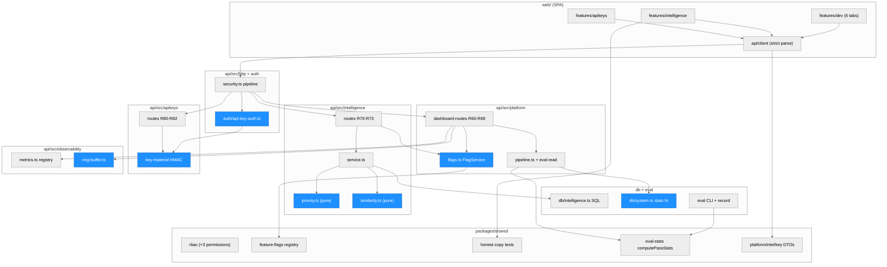

> Everything in this diagram is new or changed in step 4. Blue marks the security-relevant modules (key
> authentication, key hashing, the flag cache, log derivation, the cross-tenant aggregate function) and
> the two scoring cores.

### Module Reference (step 4)

| Module / File | Layer | Purpose | Key Exports | Changed |
| --- | --- | --- | --- | --- |
| `packages/shared/src/rbac.ts` | Shared | Adds `platform:eval` (PLATFORM_DEV), `platform:audit` (SUPER_ADMIN), `apikeys:manage` (OWNER, ADMIN) | `PERMISSION_MATRIX`, `can` | changed |
| `packages/shared/src/feature-flags.ts` | Shared | The flag registry: exactly `intelligence.provenance`, `intelligence.similar_claims`, `intelligence.worklist` (architecture test) | `FEATURE_FLAGS`, `isKnownFlag` | new |
| `packages/shared/src/honest-copy.ts` | Shared | The fixed honest texts (worklist, similar, provenance, no-accuracy, eval, telemetry, logs, pipeline notes) | `WORKLIST_NOTE`, `worklistNote`, `EVAL_NOTE`, ... | new |
| `packages/shared/src/eval-stats.ts` | Shared | pass^k statistics: per-run rate, pass^k, unbiased pass^j curve, flaky counts, Wilson 95% interval (z = 1.959964) | `computePassStats`, `binomial`, `wilsonInterval` | new |
| `packages/shared/src/{platform,intelligence,api-key}-dto.ts` | Shared | Strict Zod schemas for every step 4 request and response; the web client and the API both parse with them | schemas, `API_KEY_SCOPES`, `SCOPE_PERMISSION` | new |
| `api/src/http/security.ts`, `http/route.ts`, `http/context.ts` | API | URL guard (`fr_live_` in a URL = 400), the key branch of the pre-handler, `apiKeyScope` on route access, `RequestCtx.role = 'API_KEY'` with `viaApiKey` | `registerSecurityPipeline`, `defineRoute` | changed |
| `api/src/auth/api-key-auth.ts` | API | Machine authentication: per-IP failure gate, format, lookup, constant-time HMAC compare, state checks, route and scope checks, creator re-check, per-key limit, context | `ApiKeyAuthenticator`, `FailureGate` | new |
| `api/src/apikeys/{key-material,service,routes}.ts` | API | Key generation (`randomBytes`), HMAC-SHA-256 with the pepper, quota under a tenant lock, R80-R82 | `generateKey`, `verifySecret`, `createApiKey`, `revokeApiKey` | new |
| `api/src/audit/attribution.ts` | API | Adds `viaApiKey` and actor role `API_KEY` centrally in `appendAudit` for key-authenticated requests (DV-7) | `registerApiKeyRequest`, `apiKeyFor` | new |
| `api/src/platform/dashboard-routes.ts` | API | R60-R68: audited platform reads, strict outgoing schemas (`strictBody`), `platform` rate group | `registerPlatformDashboardRoutes` | new |
| `api/src/platform/flags.ts` | API | `FlagService`: per-instance TTL cache, fail closed, row lock + optimistic version + audit in one system transaction | `FlagService`, `validFlagReason` | new |
| `api/src/platform/pipeline.ts`, `eval-read.ts` | API | Assemble `PipelineHealth` from the SQL function (zero-fill, rates); read eval runs | `assemblePipelineHealth`, `listEvalRuns`, `getEvalRun` | new |
| `api/src/intelligence/priority.ts` | Core | `priority-v1`: score, 4-key order, "why" texts, next action (pure, integer cents) | `scoreClaim`, `compareWorklist`, `buildWhy`, `nextAction` | new |
| `api/src/intelligence/similarity.ts` | Core | `similar-v1`: carrier normalization, point scoring, inclusion rule, ranking (pure) | `scoreSimilarity`, `rankSimilar`, `normalizeCarrier` | new |
| `api/src/intelligence/{service,routes}.ts` | API | R70-R73: flag check first (off = 404), tenant-tx reads, component telemetry, `intelligence.viewed` audit | `buildWorklist`, `findSimilar`, `provenanceFor` | new |
| `api/src/db/intelligence.ts` | Data | Parameterized raw SQL for worklist, similarity features and provenance, run on the caller's tenant transaction (raw SQL stays in `db/`, DV-1) | `worklistPage`, `similarityFeatures`, `provenanceRows` | new |
| `api/src/db/system.ts` | Data | Adds `platformPipelineStats` (calls `fr_platform_pipeline_stats`) and `lockFeatureFlag` | | changed |
| `api/src/observability/metrics.ts` | API | `MetricsRegistry`: 11 fixed duration buckets, at most 200 route keys, nearest-rank bucket bounds, component stats; no I/O | `MetricsRegistry`, `DURATION_BOUNDS` | new |
| `api/src/observability/ring-buffer.ts`, `api/src/logging.ts` | API | Logger tee into a bounded ring of derived 8-field records; `route` in `serializeRes`; `fr_live_` scrubbing | `LogRingBuffer`, `deriveRecord`, `safeEvent` | new / changed |
| `api/src/eval/{manifest,runner,canonical,record,cli,git-sha}.ts` | Tool | Manifest guards, k runs through the real sandbox, canonical digests, stats, `--record` (only DB writer, system tx) | `loadSet`, `runEval`, `EVAL_STAGES`, `recordRun` | new |
| `api/eval/sets/extraction-v1/` | Data | 30 synthetic cases (9 Python-oracle, 9 rejected, 12 hand-authored) and a README | | new |
| `api/prisma/migrations/20261010000000_intelligence/` | Data | `feature_flags`, `eval_runs`, `eval_case_results`, `api_keys`, `fr_platform_pipeline_stats`, RLS FORCE, grants, triggers | | new |
| `web/src/features/dev/*`, `features/intelligence/*`, `features/apikeys/ApiKeysPage.tsx`, `api/client.ts`, `AppShell.tsx` | Web | Dev dashboard (6 lazy tabs), Intelligence page, claim-sheet Similar/Provenance tabs, API keys page, role-aware navigation | pages | new / changed |
| `.github/workflows/web-ci.yml`, `compose.web.yml`, `.env.example`, `infra/{ecs,iam,locals,variables}.tf` | Ops | CI eval gate and public CI pepper, knob passthrough, Secrets Manager container and reference `api-key-pepper` | | changed |

## Request flow: API key vs cookie/JWT authentication

Both kinds of request share the pre-handler in `api/src/http/security.ts`. The branch is chosen only by
the `Authorization` header: `Bearer fr_live_...` is a key request, any other bearer value is a user
access token exactly as before. A key request never consults a cookie, never needs a CSRF token and never
receives a cookie.

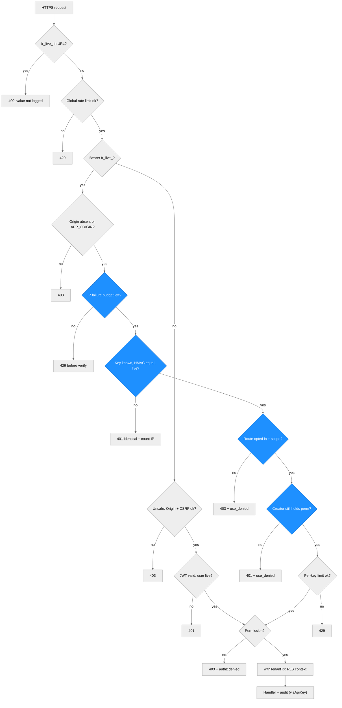

Details of the key path (`ApiKeyAuthenticator.authenticate`):

- **Lookup and compare.** The key is parsed with `^fr_live_[0-9a-f]{16}_[A-Za-z0-9_-]{43}$`. The row is
  found by `key_id` in a system transaction (the `api_keys` RLS policy allows system mode). The presented
  secret is hashed with `HMAC-SHA-256(API_KEY_PEPPER, secret)` and compared with `timingSafeEqual`; an
  unknown key id is compared against a fixed dummy digest, so the work is the same. Unknown, malformed,
  wrong secret, revoked and expired all answer the identical 401.
- **State on every request.** Revocation, expiry, tenant suspension and the creator's status are read
  from the database on every request; nothing about key state is cached, so a revocation is effective on
  the next request on every instance.
- **Route opt-in.** Only routes declared with `access.apiKeyScope` accept keys. An architecture test
  enumerates every route and requires the set to be exactly R26, R27, R53 (`claims.read`), R54
  (`exports.claims`) and R40-R44 (`imports.write`). Any other route answers 403 after a successful key
  authentication, so the denial can be audited (`apikey.use_denied` reason `route`).
- **Confused-deputy guard.** The key's permissions are `SCOPE_PERMISSION[scope]` for its scopes, and the
  creator's **current** role must still hold each one; otherwise 401 (reason `creator`). The tenant comes
  only from the key row; tenant ids in headers, query or body are ignored.
- **Abuse limits.** Failed authentications count per client address in the shared limiter store. Once
  `RATE_LIMIT_API_KEY_FAIL_MAX` (30) failures are reached in 10 minutes, the address is refused with 429
  before any verification until the window ends (the boundary fix D-4: the 31st attempt is refused, using
  the limiter's `remaining` count). The "refuse early" cache is per instance; the counts are shared.
  Successful requests then pass the per-key limiter (`RATE_LIMIT_API_KEY_MAX`, 300 per 60 s).
- **Attribution.** The context is `{tenantId: key.tenant_id, actor: creator, role: 'API_KEY',
  viaApiKey: keyId}`, and the request continues through the same `withTenantTx` path as a user request.
  `appendAudit` adds `viaApiKey` from a request registry (DV-7). `last_used_at` is updated at most once
  per 60 seconds, best effort.

### Function call graph (step 4)

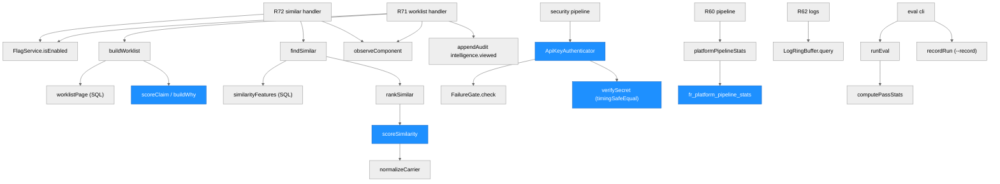

| Function | Defined In | Called By | Purpose |
| --- | --- | --- | --- |
| `scoreClaim`, `compareWorklist`, `buildWhy`, `nextAction` | `api/src/intelligence/priority.ts` | `buildWorklist` | `priority-v1` arithmetic, order and explanation; the SQL `ORDER BY` must agree with `compareWorklist` (integration test on 48 random claims) |
| `scoreSimilarity`, `rankSimilar`, `normalizeCarrier` | `api/src/intelligence/similarity.ts` | `findSimilar` | `similar-v1` points, inclusion (anchor + minimum 30), order; no caching of any kind |
| `worklistPage`, `similarityFeatures`, `provenanceRows` | `api/src/db/intelligence.ts` | intelligence service | parameterized SQL on the caller's tenant transaction, plus explicit `tenant_id = fr_current_tenant()` predicates |
| `FlagService.isEnabled` / `change` | `api/src/platform/flags.ts` | intelligence routes, R63/R64 | TTL-cached read, fail closed; locked, versioned, audited change |
| `ApiKeyAuthenticator.authenticate` | `api/src/auth/api-key-auth.ts` | security pipeline | machine authentication (see above) |
| `MetricsRegistry.observeRequest` / `observeComponent` / `snapshot` | `api/src/observability/metrics.ts` | `onResponse` hook, R71/R72, R61 | in-process telemetry |
| `LogRingBuffer.ingest` / `query` | `api/src/observability/ring-buffer.ts` | logger tee, R62 | derived log records |
| `platformPipelineStats` | `api/src/db/system.ts` | R60 | calls the `SECURITY DEFINER` function in a system transaction |
| `runEval`, `computePassStats`, `recordRun` | `api/src/eval/runner.ts`, `packages/shared/src/eval-stats.ts`, `api/src/eval/record.ts` | eval CLI | k runs per case, statistics, optional recording |

## Data model additions (step 4)

| Object | Purpose | Notable rules |
| --- | --- | --- |
| `feature_flags(key, enabled, version, updated_by_id, updated_at, last_reason)` | Global flags; the migration inserts the 3 registry rows | Not tenant-scoped (holds no tenant data). RLS FORCE; SELECT for all, UPDATE only in system mode; `freight_app` has `SELECT` and column-level `UPDATE` only; a trigger requires `key` unchanged and `version = old + 1`; DELETE and TRUNCATE raise for every role |
| `eval_runs`, `eval_case_results` | Recorded evaluation runs and per-case results (no document content, values or file names) | RLS FORCE with a system-mode-only policy (a raw connection sees zero rows and cannot insert); `SELECT, INSERT` grants only; UPDATE, DELETE and TRUNCATE raise in every mode; CHECKs tie the counts together (`runs_passed <= runs_total`, `pass_hat_k_count <= pass_at_least_one_count <= case_count`, curve length = k, `passed_all = (runs_passed = k)`) |
| `api_keys(id, tenant_id, key_id, name, secret_hash, scopes, created_by_id, created_at, expires_at, last_used_at, revoked_at, revoked_by_id, revoke_reason)` | Tenant API keys | Tenant-scoped, in `TENANT_MODELS`; policy `tenant_id = fr_current_tenant() OR fr_system_mode()` (system mode for the lookup by `key_id`); CHECKs on `key_id` (16 hex), `secret_hash` (64 hex), 1-3 scopes from the three, name length, revoke-reason length and all-or-nothing revoke columns; only `last_used_at` and the revoke columns are updatable, revocation is set once and never cleared; DELETE/TRUNCATE raise |
| `fr_platform_pipeline_stats(window_seconds, stale_seconds)` | Cross-tenant aggregate for R60 | `SECURITY DEFINER`, `search_path` pinned, raises unless system mode, range-checks its inputs, `EXECUTE` granted to `freight_app` only; returns `(metric, label, n, p50_ms, p95_ms)` rows and never selects a tenant id, user id, name, file name, storage key, hash or claim number |
| index `claims (tenant_id, status, updated_at DESC, id)` | Worklist and similarity queries | plans recorded in the run's `implementation.md` (no timings claimed) |

## Flag cache

`FlagService.isEnabled(key)` keeps a per-instance cache keyed by flag with TTL `FLAGS_CACHE_TTL_MS`
(default 5000 ms, production ceiling 30000 ms, 0 disables it). A read error returns **false** (fail
closed) and is not cached for more than 1 second. A change (`PUT /platform/flags/:key`) runs in one system
transaction: registry check (unknown key = 404 before any DB access), `SELECT ... FOR UPDATE`, version
compare (409 `stale_revision`), same value (409 `conflict`, nothing written), update with `version + 1`,
`platform.flag_changed` audit; the local cache is invalidated after commit. Other instances see the change
within their TTL. Flags gate only the three intelligence features; they cannot reach auth, CSRF, RLS or
audit code paths (architecture test).

## Observability: telemetry registry and log ring buffer

- **Telemetry.** A Fastify `onResponse` hook (registered before the routes, so health routes count)
  records the route **pattern** (`routeOptions.url`, or `(unmatched)`), the method (unknown methods
  become `OTHER`), the status and `reply.elapsedTime`. It never reads the URL, query, headers or body.
  Memory is bounded: at most 200 route keys (overflow into `(other)`) times 11 buckets. Percentiles are
  reported as the upper bound of the bucket that holds the nearest rank. The parser executor counters and
  the two component stats are added at snapshot time. Nothing touches the database.
- **Log ring buffer.** `createLogger` tees every formatted (already redacted) line into
  `LogRingBuffer(LOG_BUFFER_SIZE)`. `ingest` parses the line inside try/catch and keeps only a derived
  record of 8 fields (time, level, request id if a UUID, method if standard, route if it starts with `/`,
  has no `?` and is at most 200 characters, status 100-599, finite duration, event if it passes the
  message rule); everything else is discarded, and the buffer never throws into the logger. The logger
  additionally replaces any `fr_live_...` string at any depth with `[REDACTED]`. Telemetry and logs are
  **per instance and ephemeral**, and the UI says so.

## Evaluation tool (data flow)

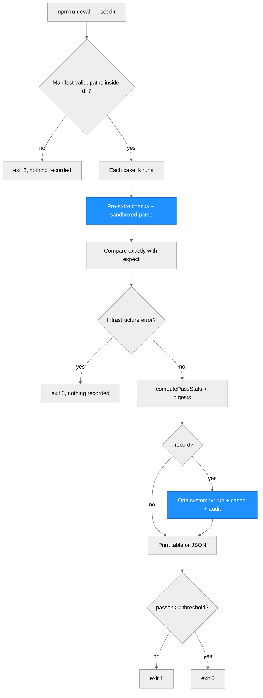

The stage registry `EVAL_STAGES` currently holds `extraction` only; step 5 registers `rules`. The set
hash `evalSetSha256` covers the manifest and every case file in order; fixtures are kept byte-exact by
`.gitattributes` (`api/eval/sets/** -text`).

## Interfaces for step 5

1. The intelligence features read only persisted columns (`claims` amounts, status, carrier,
   perspective, `updated_at`; the latest `evidence_packets` revision; `packet_findings.rule_id` and
   `needs_human_review`; `packet_sources.doc_type`; `approvals.created_at`). When step 5 creates packet
   revision 1 (`AWAITING_ANALYSIS -> PENDING_REVIEW`), the worklist, similarity and provenance light up
   without a step 4 change. Step 5 must keep `rule_id` stable and non-empty.
2. Step 5 registers a `rules` stage in `EVAL_STAGES` (and widens the `stage` CHECK by migration), reusing
   `computePassStats`, the recorder and the dashboard; the Python `run_pipeline` is the oracle.
3. Telemetry: step 5 adds `observeComponent('rules-v1', ...)`. Flags: step 5 may add a registry key.

## Notes (step 4)

- Deviations recorded by the builder (DV-1..DV-11), most relevant: raw SQL lives in `db/` (DV-1); the
  route table has 199 keys plus `(other)` (DV-2); audited reads append in their own transaction after
  the data is computed, and a failed append still returns 500 with no data (DV-3); `API_KEY_PEPPER` has
  a public default outside production (DV-4); a key on a non-key route gets 403 even for `/healthz`, and
  an `Origin` on a key request is checked for every method (DV-5); the per-IP "refuse early" cache is per
  instance (DV-6); platform users land on `/dev` (DV-11).
- Deferred (design only, not built): per-key IP allow-lists, key rotation helpers (create-then-revoke is
  the manual path), HMAC request signing, per-key usage dashboards, more scopes, four-eyes on flag
  changes, cluster-wide telemetry and logs, any learned ranker.
- Not verified: container images, the compose stack, Playwright end-to-end tests, any AWS deployment.
