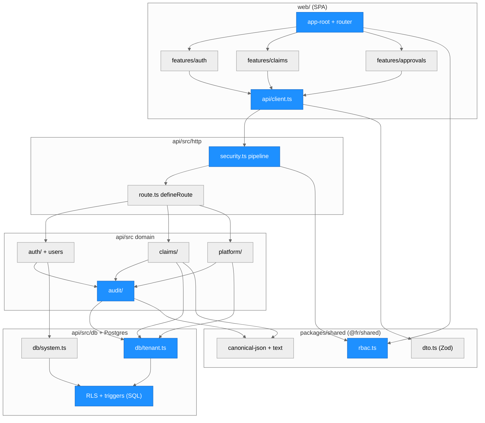
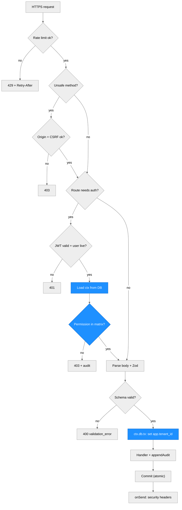
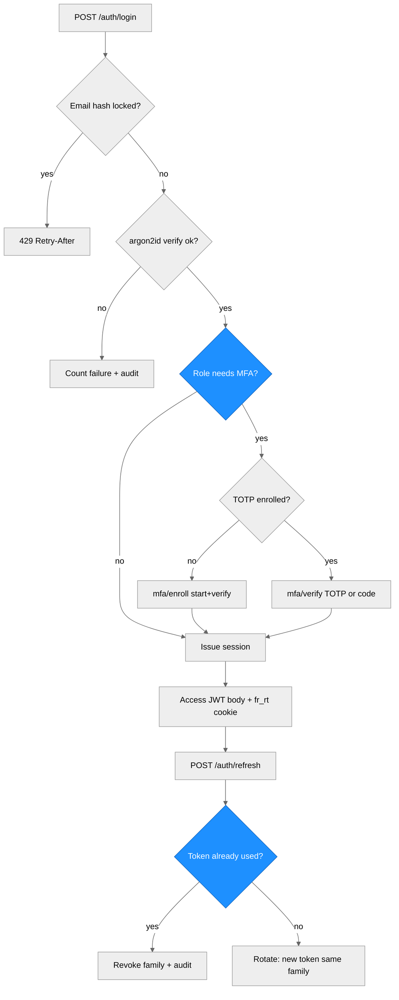
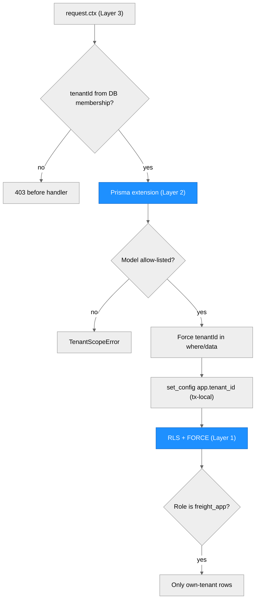
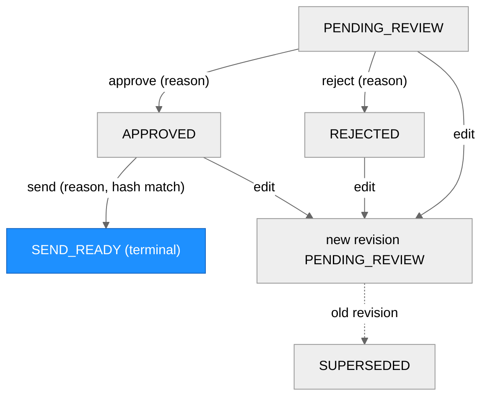
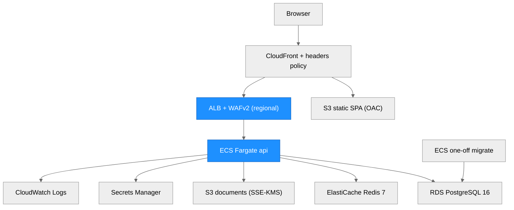

# Architecture (MVP, pre-product)

```
files (PDF/CSV/TXT)
   |  ingest/        bytes -> RawDocument (text, doc_type, sha256)
   v
 extraction/        RawDocument -> Invoice | RateConfirmation | BillOfLading   (swappable provider)
   |  extract_bundle -> ExtractedBundle (+ warnings)
   v
 rules/             ExtractedBundle -> Findings -> RecoveryResult (per perspective)
   v
 evidence/          documents + findings + calculations + DRAFT letter -> EvidencePacket (+ markdown)
   v
 api/ (FastAPI) and cli.py     thin adapters over pipeline.run_pipeline
```

Request path in the API (production foundation):

```
request -> BodySizeLimitMiddleware -> AuthenticatedRoute (API key -> tenant, BEFORE the body is parsed)
        -> persist Analysis(running) + raw docs via StorageProvider      [db/, storage/; tenant-scoped]
        -> sandbox worker process: ingest -> extract -> rules -> evidence  [sandbox/; time+memory bounded]
        -> mark Analysis succeeded|failed (+ result JSON)                  [tenant-scoped repository]
```

## Modules (`src/freight_recovery/`)
| Module | Responsibility |
|---|---|
| `models.py` | pydantic v2 domain types; money is `Decimal`; `Finding`, `RecoveryResult`, `EvidencePacket` |
| `config.py` | env-driven `Settings` (`FR_*`), secrets excluded from `repr`, `validate_for_production()` guard |
| `keys.py`, `auth.py` | API-key format/HMAC hashing; `AuthenticatedRoute` resolves the tenant from the key before the body is read (401 no key / 403 invalid) |
| `admin.py` | operator CLI: tenants and API keys (`python -m freight_recovery.admin`) |
| `db/` | SQLAlchemy 2 tables (`tables.py`), tenant-bound `AnalysisRepository` and unscoped `TenantAdminRepository` (`repository.py`), engine/session factories, Alembic migrations (`migrations/`, `migrate.py`) |
| `storage/` | `StorageProvider` interface: `LocalFilesystemStorage` (default), `S3Storage` stub behind two flags; tenant-prefixed keys built only from validated ids |
| `sandbox/` | `run_isolated` / `SandboxRunner`: one worker subprocess per job with wall-clock, memory, CPU and output limits and a clean environment; `targets.analyze` is the analysis job |
| `ingest/` | decode PDF (pdfplumber, lazy import) / CSV (flattened to `Key: Value`) / TXT; classify doc type; sha256 |
| `extraction/` | `ExtractionProvider` Protocol; `DeterministicStubProvider` (default, offline); `LLMExtractionProvider` placeholder; `extract_bundle` |
| `rules/` | `detention.py` (auditable calculation), `invoice_checks.py` (rate/fuel/accessorial/duplicate/total), `engine.py` (perspective totals) |
| `evidence/` | `letter.py` deterministic draft letter; `packet.py` assembles packet and markdown |
| `pipeline.py` | `run_pipeline(files, perspective)` - the single orchestration entry point |
| `api/main.py` | `create_app()` factory + `app`; authenticated routes, tenant-scoped persistence, gated docs; `cli.py` for local use (no auth/DB) |

## Key decisions
- **Provider interface, deterministic default.** The pipeline depends only on `ExtractionProvider`. The stub makes tests reproducible and offline; a hosted-model provider can be added without touching rules or evidence. Model output must be validated by pydantic and never trusted for arithmetic: **all money math is in `rules/`, in Decimal.**
- **Rules produce explainable findings.** Every finding carries rule id, amount, confidence, and a step-by-step calculation; uncertain ones set `needs_human_review`. Duplicates are removed before rate comparisons to avoid double counting.
- **Two perspectives, one engine.** Findings are directional (`overcharge` vs `underbilled`); the chosen perspective sums its direction and reports the rest as ignored.
- **Human in the loop.** Output is a draft packet; nothing is sent. Every packet carries a disclaimer.
- **Tenant isolation by construction.** The tenant comes only from the API key. `AnalysisRepository` is bound to one tenant at construction and every query filters on it; another tenant's id is a 404; storage keys carry the tenant prefix and are re-checked on read. PostgreSQL row-level security is the next layer of defense in depth.
- **Persistence behind a repository.** SQLAlchemy 2 + Alembic; SQLite locally/tests, PostgreSQL (RDS) in production. An `analyses` row is both the job record (queued/running/succeeded/failed) and the result, so an async worker can adopt it without a schema change. Money is stored as integer cents plus the exact packet JSON.
- **Bounded parsing.** Hostile input is parsed in a separate, resource-limited worker process, never in the API process. This is process isolation, not an OS sandbox; seccomp/read-only-rootfs/no-egress containment is a deployment-layer control (`deploy/aws.md`).
- **No queue yet.** Analyses run synchronously within the request (bounded by the worker pool and a 503 back-pressure); an async job queue is a next step for large documents.
- **Evidence integrity.** Original-bytes sha256 recorded per document.

## Forecasting (roadmap)
`forecast/` is an optional, future capability (not in the core flow): a `Forecaster` interface, a stdlib seasonal-naive/moving-average baseline (default, tested), and a lazily-imported `neuralforecast` backend behind the `[forecast]` extra, off by default and not validated (needs real multi-series data; often only ties baselines). No accuracy claims.

## Known gaps
Scanned-PDF OCR; multi-document/multi-stop loads; timezone-aware timestamps; contract/tariff-specific rules; carrier-specific charge codes; dispute deadlines and status tracking; integrations (TMS/EDI/carrier portals); payments/credit reconciliation; rate limiting, malware scanning, retention policy, an async job queue; and the external security audit / compliance sign-off. The project's research plan (eval set first, independent verifier, measured pass^k) lives in `technical/` and is not yet implemented here.

---

# Web platform (TypeScript, steps 1-2)

> Written by scriber for run `REQ-20261008-webapp-foundation` on 2026-10-08. **Pre-product, synthetic
> data only, never deployed.** The Python service above and the `webapp/` pilot dashboard are unchanged and
> still run on their own. Threat model and known gaps:
> [technical/web-platform-security.md](technical/web-platform-security.md).

## Overview

An npm-workspaces monorepo next to the Python service. `web/` is a React 19 + Vite SPA (React Router,
TanStack Query, Zustand, Tailwind). `api/` is Node 22 + Fastify 5 + Prisma 7 on PostgreSQL 16, with Zod
validation and Pino logs. `packages/shared/` (`@fr/shared`) holds the roles, the permission matrix,
canonical JSON, text safety and the DTO schemas; both sides import it. `infra/` is a Terraform skeleton for
AWS. Build-order steps 1 and 2 are implemented: authN (argon2id, access JWT plus a rotating refresh
cookie, TOTP MFA, lockout), RBAC across 8 roles, 3-layer tenant isolation, app hardening, a hash-chained
append-only audit trail, the claims list, the evidence-packet viewer and the approvals human gate.
Import/export, the dev dashboard, AI features and the TS port of the Python rules are later steps. Claims
and packets are seeded from the Python CLI output on `tests/fixtures/` (synthetic).

## Module Structure



> Everything in this diagram is new in this run. Blue marks the security-critical modules.

### Module Reference

| Module / File | Layer | Purpose | Key Exports | Changed |
| --- | --- | --- | --- | --- |
| `packages/shared/src/rbac.ts` | Shared | **Single source of truth** for roles and the frozen permission matrix | `ROLES`, `PERMISSION_MATRIX`, `can`, `canAssignRole`, `canManageUserWithRole`, `MFA_REQUIRED_ROLES` | new |
| `packages/shared/src/dto.ts` | Shared | Strict request schemas and response DTOs (also `CLAIM_SORT_FIELDS`) | Zod schemas | new |
| `packages/shared/src/canonical-json.ts`, `text.ts`, `money.ts` | Shared | Canonical JSON for hashing; `displayText` and unsafe-character checks; integer-cent formatting | `canonicalJson`, `GENESIS_HASH`, `displayText`, `formatUsdCents` | new |
| `api/src/app.ts`, `server.ts`, `config.ts` | API | App factory; fail-safe config (production guards, secret checks) | `buildApp`, `loadConfig`, `secretEntropyProblem` | new |
| `api/src/http/security.ts` | API | One `onRequest` pipeline: rate limit → Origin → CSRF → authN → permission; security headers | `registerSecurityPipeline` | new |
| `api/src/http/route.ts` | API | `defineRoute`; the boot fails if a route lacks an access declaration; Zod validation in `preHandler` | `defineRoute` | new |
| `api/src/security/*` | API | argon2id, HS256 JWT (per-purpose key/typ/aud), TOTP, CSRF, HKDF/AES-GCM, lockout math | | new |
| `api/src/auth/*` | API | Login, MFA, refresh rotation + reuse detection, forgot/reset, invites, users (R3-R23), dev outbox (R38) | `authenticateAccessToken`, `rotateRefreshToken`, route registrars | new |
| `api/src/claims/*` | API | List/sort/search (`escapeLike`), packet viewer, content hash, review state machine, approvals (R26-R34) | `canTransition`, `packetContentHash` | new |
| `api/src/platform/*` | API | Health, tenant stats, SUPER_ADMIN cross-tenant read (audited first) | `crossTenantRead` | new |
| `api/src/audit/*` | API | Hash chain, append under an advisory lock, verifier, list/verify routes | `appendAudit`, `ChainVerifier` | new |
| `api/src/db/tenant.ts`, `system.ts` | Data | Layer-2 fail-closed tenant extension; system-mode transactions (restricted by lint) | `withTenantTx`, `withSystemTx` | new |
| `api/prisma/migrations/20261008000000_init/migration.sql`, `api/db/init/00-roles.sql` | Data | Schema, RLS + FORCE, least-privilege grants, append-only and state-machine triggers, DB roles | | new |
| `web/src/api/client.ts` | Web | Access token in memory, CSRF header, single-flight refresh (Web Locks across tabs) | `ApiClient` | new |
| `web/src/features/{auth,shell,claims,approvals}` | Web | Login/MFA/reset/invite pages, shell + command palette, claims table + detail sheet, approvals queue | pages | new |
| `infra/*.tf` | Infra | AWS skeleton (fmt/validate only, never applied) | | new |
| `compose.web.yml`, `.github/workflows/web-ci.yml` | Ops | Separate local stack and CI; the Python `docker-compose.yml` and `ci.yml` are untouched | | new |

## Request pipeline (data flow)



AuthN and authZ run in `onRequest`, before the body is parsed. An unauthenticated or forbidden request
therefore gets 401/403 even when its body is invalid. A business change and its audit event commit in
the same transaction: if the audit append fails, the request returns 500 and nothing changes.

## Authentication flows



| Flow | Routes (under `/api/v1`) | Key rules |
| --- | --- | --- |
| Login | `POST /auth/login` | argon2id with a dummy verify for unknown or disabled users; per-email-hash lockout `min(30·2^(f-5), 900)` s after 5 failures; auth rate limit 20/60 s per IP |
| MFA | `/auth/mfa/verify`, `/auth/mfa/enroll/start`, `/auth/mfa/enroll/verify` | mandatory for OWNER, ADMIN, PLATFORM_DEV, SUPER_ADMIN; RFC 6238 ±1 step; accepted step strictly increasing (no replay); single-use recovery codes |
| Session | `/auth/refresh`, `/auth/logout`, `GET /me` | access JWT (10 min) is kept in JS memory; `fr_rt` cookie `HttpOnly; Secure; SameSite=Strict; Path=/api/v1/auth`; DB stores an HMAC of the token; reuse revokes the family; family max 30 days |
| CSRF | `GET /auth/csrf` | `fr_csrf` cookie == `X-CSRF-Token` == `nonce.HMAC(secret, nonce)`, plus an Origin check |
| Recovery | `/auth/forgot`, `/auth/reset`, `/auth/change-password` | same response for unknown emails; reset revokes all sessions; forgot limited to 5/15 min |
| Invites | `/users/invites`, `/auth/invites/inspect`, `/auth/invites/accept` | role assignment is rank-based (`canAssignRole`); OWNER is never assignable |

## RBAC

`packages/shared/src/rbac.ts` is the single source of truth. The API checks `can(role, permission)`
on every request. The web app imports the same frozen data only to hide controls.

| Permission | OWNER | ADMIN | MANAGER | REVIEWER | ANALYST | VIEWER | PLATFORM_DEV | SUPER_ADMIN |
| --- | --- | --- | --- | --- | --- | --- | --- | --- |
| `claims:read` | x | x | x | x | x | x | | |
| `claims:assign` | x | x | x | | | | | |
| `packets:edit`, `packets:approve` | x | x | x | x | | | | |
| `demands:send` | x | x | x | | | | | |
| `import:run` (no route yet) | x | x | x | x | x | | | |
| `users:read`, `users:manage`, `audit:read`, `settings:manage`, `integrations:manage` | x | x | | | | | | |
| `admins:manage`, `billing:manage`, `tenant:delete` | x | | | | | | | |
| `platform:health` | | | | | | | x | x |
| `platform:flags`, `platform:logs` | | | | | | | x | |
| `platform:tenants:list`, `platform:cross_tenant_read` | | | | | | | | x |

Platform roles have no tenant and no tenant data permission. A SUPER_ADMIN cross-tenant read is
read-only, needs a reason of at least 10 characters, and is audited into the target tenant's chain first.
There is no Team model, so every tenant role sees all claims of its tenant (assumption A4).

## Tenant isolation (three layers, fail closed)



- **Layer 1, PostgreSQL RLS.** Every tenant-scoped table (`claims`, `evidence_packets`, the packet child
  tables, `approvals`, `memberships`, `invites`, `audit_events`) has `ENABLE` and `FORCE ROW LEVEL
  SECURITY` with `USING/WITH CHECK (tenant_id = fr_current_tenant())`. With no `app.tenant_id` set,
  queries see zero rows. Only `memberships` and `invites` also allow `fr_system_mode()` (auth bootstrap),
  and the `platform` audit chain is visible only in system mode.
- **Roles.** The API runs as `freight_app` (`NOSUPERUSER NOBYPASSRLS NOINHERIT`, not the owner; DML
  grants only; `evidence_packets` gets `UPDATE (status)` only; append-only tables get `SELECT, INSERT`
  only). `freight_owner` owns the schema and runs migrations, the seed and test fixtures (BYPASSRLS).
- **Layer 2, fail-closed Prisma extension** (`api/src/db/tenant.ts`). Models are allow-listed;
  `tenantId` is injected into every where clause and create, and a conflicting value throws. Raw SQL is
  blocked on the tenant client.
- **Layer 3, request context.** User, role, tenant status and refresh-family liveness are reloaded from
  the DB on every request, never from token claims. Platform users get `db = null`.

## Audit hash chain

- One chain per tenant (`chain_key = t:<tenantId>`) plus a `platform` chain.
  `hash_n = SHA-256(hash_{n-1} + "\n" + canonicalJson(event_n))`; genesis is 64 zeros; `seq` is contiguous
  under `pg_advisory_xact_lock(hashtextextended(chain_key, 0))`.
- Triggers block UPDATE, DELETE and TRUNCATE on `audit_events` (and on `approvals`, `login_attempts`
  and the packet child tables), even for the owner. Only `db:seed -- --reset` in dev/test bypasses them
  through `session_replication_role`.
- `GET /api/v1/audit/verify` (`audit:read`) recomputes the chain and reports `brokenAtSeq`. Metadata
  passes through a whitelist; failed logins are recorded with `actor = null`.

## Approval state machine



Every action needs a reason and writes an append-only `approvals` row plus an audit event in one
transaction, with the claim row locked `FOR UPDATE`. Approve records the packet's canonical content hash.
Send recomputes it and requires it to equal both the approval's hash and the stored hash. "Send" only
marks the demand send-ready: no email, no payment. The DB trigger `fr_packet_update_guard` enforces
the same transitions and makes every column except `status` immutable. Edit creates a new revision; the
approval row records the base revision (deviation 18).

| Function | Defined In | Called By | Purpose |
| --- | --- | --- | --- |
| `canTransition`, `targetStatus` | `api/src/claims/state-machine.ts` | claims service | transition table (mirrors the SQL trigger) |
| `packetContentHash` | `api/src/claims/content-hash.ts` | approve, edit, send, viewer integrity | canonical hash with ordinals instead of UUIDs |
| `lockClaimForUpdate` | `api/src/db/tenant.ts` | claims service | serializes concurrent decisions |
| `appendAudit` | `api/src/audit/audit.ts` | every mutating handler, cross-tenant read | chain append in the caller's transaction |
| `crossTenantRead` | `api/src/platform/cross-tenant.ts` | platform routes | audit first, then read, fail closed |

## AWS mapping (web stack)

`infra/` replaces `deploy/terraform/` **for the web stack only**. It follows the principles in
[deploy/aws.md](deploy/aws.md): secrets come from Secrets Manager through the task definition and are
never in state, migrations run as a one-shot ECS task before the rollout, the WAF sits in front, and
nothing is applied automatically.



| Component | Local (`compose.web.yml`) | AWS (`infra/`) |
| --- | --- | --- |
| SPA | nginx-unprivileged, headers from `web/security-headers.json` | S3 + CloudFront (OAC), response-headers policy generated from the same JSON |
| API | `api` container (uid 10001, read-only root fs, caps dropped) | ECS Fargate, same hardening, private subnets, VPC endpoints (no NAT) |
| Edge | loopback only | ALB reachable only from CloudFront origin ranges, TLS 1.2/1.3 policy, WAFv2 (managed rules, IP rate limit, Content-Length > 64 KiB) |
| DB | `postgres:16.15-alpine` + `00-roles.sql` | RDS PostgreSQL 16, KMS, `rds.force_ssl=1`, managed master password; roles applied by an operator |
| Rate-limit store | `redis:7-alpine` | ElastiCache Redis 7, TLS + at-rest encryption, AUTH token set out of band |
| Documents | MinIO (`chainguard/minio`) | S3 SSE-KMS, versioning, task role limited to the `t/*` prefix |
| Secrets | public `local-dev-*` values (refused in production) | 7 Secrets Manager containers; values set out of band |

## Architectural Patterns

- **Security pipeline as one hook**: an exact, testable order (rate → Origin → CSRF → authN → authZ → validation).
- **Fail closed everywhere**: unknown routes refuse to boot; unset tenant means zero rows; an audit failure rolls back the business change; the production config refuses dev values.
- **Shared contract package**: roles, matrix and DTOs are defined once in `@fr/shared` and used by API and web.
- **Defense in depth in the database**: RLS, grants and triggers enforce the invariants even if application code is wrong.
- **Content-addressed approvals**: decisions bind to a canonical hash, not to a mutable row.

## Notes

- Deviations from the brief: Node 22 instead of 20 (Node 20 is EOL); a Prisma client extension instead of the removed `$use` middleware; eslint 9; framer-motion omitted. The full list (22 items) is in the run's `implementation.md`.
- Not verified: Docker images and the compose stack, Playwright e2e, any AWS deployment. See the threat model's "Known gaps".
