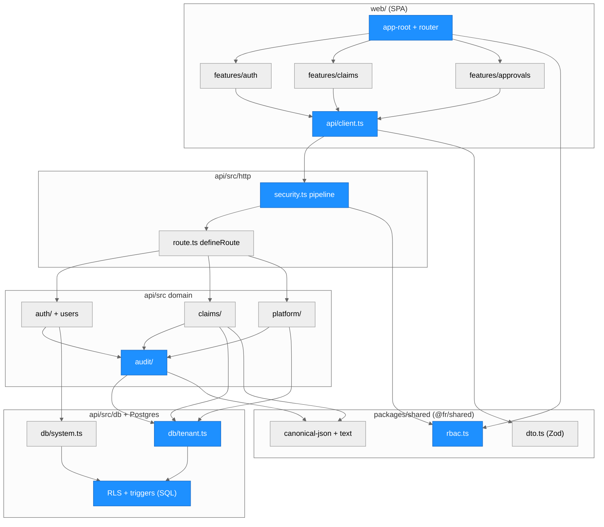
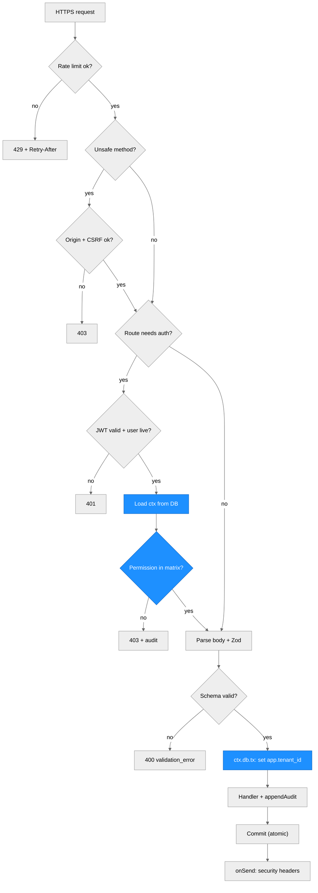
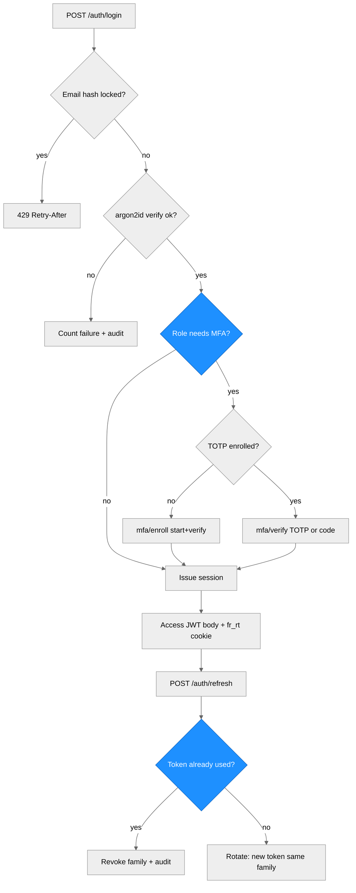
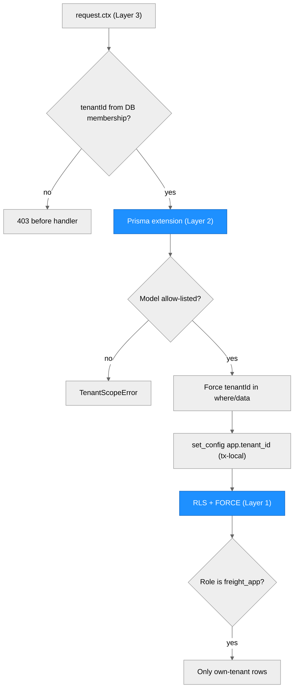
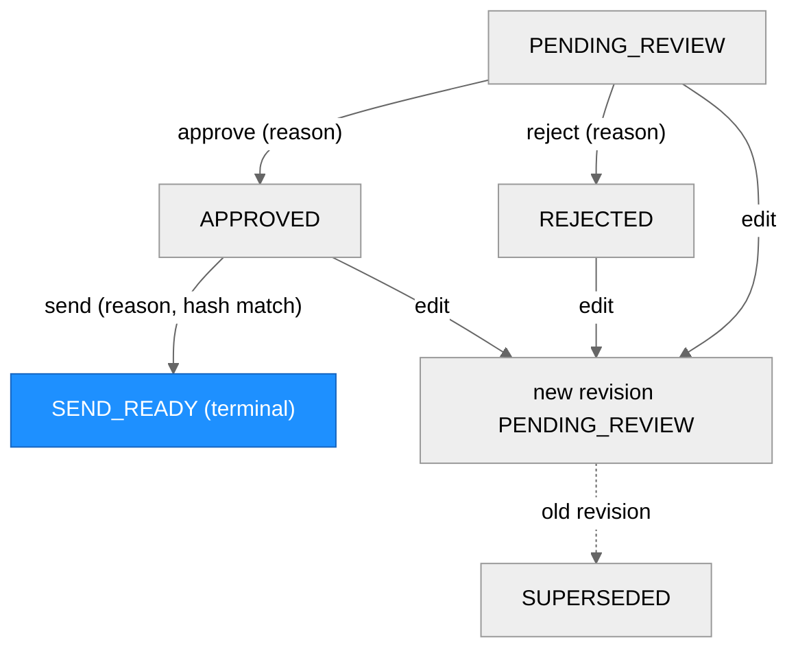
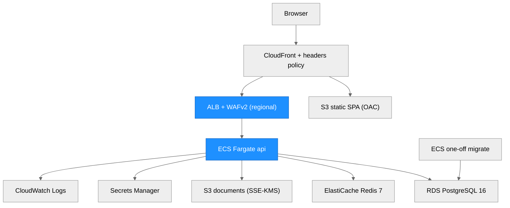

> **Uoffisiell oversettelse (bokmål).** Bekvemmelighetsoversettelse, ikke juridisk/finansiell fagoversettelse. Ved avvik gjelder den engelske originalen ([ARCHITECTURE.md](ARCHITECTURE.md)). Juridisk og skattemessig innhold er utkast og må gjennomgås av advokat/rådgiver før bruk.

# Arkitektur (MVP, før produkt)

```
files (PDF/CSV/TXT)
   |  ingest/        bytes -> RawDocument (text, doc_type, sha256)
   v
 extraction/        RawDocument -> Invoice | RateConfirmation | BillOfLading   (utskiftbar leverandør)
   |  extract_bundle -> ExtractedBundle (+ warnings)
   v
 rules/             ExtractedBundle -> Findings -> RecoveryResult (per perspektiv)
   v
 evidence/          dokumenter + funn + beregninger + UTKAST til brev -> EvidencePacket (+ markdown)
   v
 api/ (FastAPI) og cli.py     tynne adaptere over pipeline.run_pipeline
```

Forespørselsløpet i API-et (produksjonsfundament):

```
request -> BodySizeLimitMiddleware -> AuthenticatedRoute (API-nøkkel -> tenant, FØR body parses)
        -> lagre Analysis(running) + rådokumenter via StorageProvider      [db/, storage/; tenant-avgrenset]
        -> sandbox-arbeiderprosess: ingest -> extract -> rules -> evidence  [sandbox/; tids- og minnebegrenset]
        -> marker Analysis succeeded|failed (+ resultat-JSON)               [tenant-avgrenset repository]
```

## Moduler (`src/freight_recovery/`)
| Modul | Ansvar |
|---|---|
| `models.py` | pydantic v2-domenetyper; penger er `Decimal`; `Finding`, `RecoveryResult`, `EvidencePacket` |
| `config.py` | miljødrevet `Settings` (`FR_*`), hemmeligheter utelatt fra `repr`, `validate_for_production()`-vern |
| `keys.py`, `auth.py` | API-nøkkelformat/HMAC-hashing; `AuthenticatedRoute` finner tenant fra nøkkelen før body leses (401 ingen nøkkel / 403 ugyldig) |
| `admin.py` | operatør-CLI: tenanter og API-nøkler (`python -m freight_recovery.admin`) |
| `db/` | SQLAlchemy 2-tabeller (`tables.py`), tenant-bundet `AnalysisRepository` og ubegrenset `TenantAdminRepository` (`repository.py`), engine-/sesjonsfabrikker, Alembic-migrasjoner (`migrations/`, `migrate.py`) |
| `storage/` | `StorageProvider`-grensesnitt: `LocalFilesystemStorage` (standard), `S3Storage`-stub bak to flagg; tenant-prefiksede nøkler bygget kun av validerte id-er |
| `sandbox/` | `run_isolated` / `SandboxRunner`: én arbeiderunderprosess per jobb med grenser for veggklokketid, minne, CPU og utdata, og et rent miljø; `targets.analyze` er analysejobben |
| `ingest/` | dekoder PDF (pdfplumber, lat import) / CSV (flatet ut til `Key: Value`) / TXT; klassifiserer dokumenttype; sha256 |
| `extraction/` | `ExtractionProvider`-Protocol; `DeterministicStubProvider` (standard, offline); `LLMExtractionProvider`-plassholder; `extract_bundle` |
| `rules/` | `detention.py` (etterprøvbar beregning), `invoice_checks.py` (rate/drivstoff/tilleggsgebyr/duplikat/sum), `engine.py` (totaler per perspektiv) |
| `evidence/` | `letter.py` deterministisk utkast til brev; `packet.py` setter sammen pakke og markdown |
| `pipeline.py` | `run_pipeline(files, perspective)` - det eneste orkestreringsinngangspunktet |
| `api/main.py` | `create_app()`-fabrikk + `app`; autentiserte ruter, tenant-avgrenset persistens, portstyrte docs; `cli.py` for lokal bruk (ingen auth/DB) |

## Viktige beslutninger
- **Leverandørgrensesnitt, deterministisk standard.** Pipelinen avhenger kun av `ExtractionProvider`. Stubben gjør tester reproduserbare og offline; en leverandør med hostet modell kan legges til uten å røre regler eller bevis. Modellutdata må valideres av pydantic og aldri stoles på for aritmetikk: **all pengematematikk ligger i `rules/`, i Decimal.**
- **Regler gir forklarbare funn.** Hvert funn bærer regel-id, beløp, konfidens og en steg-for-steg-beregning; usikre setter `needs_human_review`. Duplikater fjernes før ratesammenligning for å unngå dobbelttelling.
- **To perspektiver, én motor.** Funn er retningsbestemte (`overcharge` mot `underbilled`); det valgte perspektivet summerer sin retning og rapporterer resten som ignorert.
- **Menneske i løkken.** Utdata er en utkastpakke; ingenting sendes. Hver pakke har en ansvarsfraskrivelse.
- **Tenant-isolasjon ved konstruksjon.** Tenanten kommer kun fra API-nøkkelen. `AnalysisRepository` er bundet til én tenant ved opprettelse og hver spørring filtrerer på den; en annen tenants id gir 404; lagringsnøkler bærer tenant-prefikset og sjekkes på nytt ved lesing. PostgreSQL radnivåsikkerhet (row-level security) er neste lag i dybdeforsvaret.
- **Persistens bak et repository.** SQLAlchemy 2 + Alembic; SQLite lokalt/i tester, PostgreSQL (RDS) i produksjon. En `analyses`-rad er både jobbposten (queued/running/succeeded/failed) og resultatet, slik at en asynkron arbeider kan overta den uten skjemaendring. Penger lagres som heltallsører/cent pluss eksakt pakke-JSON.
- **Avgrenset parsing.** Fiendtlig input parses i en separat, ressursbegrenset arbeiderprosess, aldri i API-prosessen. Dette er prosessisolasjon, ikke en OS-sandbox; seccomp/skrivebeskyttet rotfilsystem/ingen utgående trafikk (egress) er en kontroll på utrullingslaget (`deploy/aws.md`).
- **Ingen kø ennå.** Analyser kjører synkront innenfor forespørselen (avgrenset av arbeiderpoolen og 503-mottrykk); en asynkron jobbkø er et neste steg for store dokumenter.
- **Bevisintegritet.** sha256 av originalbytes registreres per dokument.

## Prognoser (veikart)
`forecast/` er en valgfri, fremtidig funksjon (ikke i kjerneflyten): et `Forecaster`-grensesnitt, en stdlib sesongnaiv/glidende-gjennomsnitt-baseline (standard, testet) og en lat importert `neuralforecast`-backend bak `[forecast]`-tillegget, av som standard og ikke validert (trenger reelle data med flere tidsserier; ofte bare likt med baselines). Ingen påstander om treffsikkerhet.

## Kjente mangler
OCR for skannede PDF-er; laster med flere dokumenter/stopp; tidssonebevisste tidsstempler; kontrakts-/tariffspesifikke regler; transportørspesifikke gebyrkoder; tvistefrister og statussporing; integrasjoner (TMS/EDI/transportørportaler); betalinger/kreditt-avstemming; ratebegrensning, malware-skanning, oppbevaringspolicy, en asynkron jobbkø; og den eksterne sikkerhetsrevisjonen / samsvarsgodkjenningen. Prosjektets forskningsplan (eval-sett først, uavhengig verifikator, målt pass^k) ligger i `technical/` og er ennå ikke implementert her.

---

# Nettplattform (TypeScript, steg 1-2)

> Skrevet av scriber for kjøringen `REQ-20261008-webapp-foundation` 2026-10-08. **Før produkt, kun
> syntetiske data, aldri utrullet.** Python-tjenesten ovenfor og pilotdashbordet `webapp/` er uendret og
> kjører fortsatt for seg selv. Trusselmodell og kjente mangler (engelsk):
> [technical/web-platform-security.md](technical/web-platform-security.md). Mermaid-diagrammene er de
> samme som i den engelske originalen ([ARCHITECTURE.md](ARCHITECTURE.md#web-platform-typescript-steps-1-2)),
> slik at de holdes i takt med den.

## Oversikt

Et npm-workspaces-monorepo ved siden av Python-tjenesten. `web/` er en React 19 + Vite SPA (React
Router, TanStack Query, Zustand, Tailwind). `api/` er Node 22 + Fastify 5 + Prisma 7 på PostgreSQL 16, med
Zod-validering og Pino-logger. `packages/shared/` (`@fr/shared`) inneholder rollene, tillatelsesmatrisen,
kanonisk JSON, tekstsikkerhet og DTO-skjemaene; begge sider importerer den. `infra/` er et
Terraform-skjelett for AWS. Byggesteg 1 og 2 er implementert: autentisering (argon2id, tilgangs-JWT pluss
en roterende refresh-informasjonskapsel, TOTP-MFA, utestenging), RBAC for 8 roller, tenant-isolasjon i
tre lag, applikasjonsherding, et hashkjedet revisjonsspor som bare kan utvides, kravlisten, visningen av
bevispakken og godkjenningsporten med menneske i løkken. Import/eksport, utviklerdashbordet,
AI-funksjoner og TS-porten av Python-reglene er senere steg. Krav og pakker seedes fra Python-CLI-ens
utdata på `tests/fixtures/` (syntetisk).

## Modulstruktur



> Alt i dette diagrammet er nytt i denne kjøringen. Blått markerer de sikkerhetskritiske modulene.

### Modulreferanse

| Modul / fil | Lag | Formål | Viktige eksporter | Endret |
| --- | --- | --- | --- | --- |
| `packages/shared/src/rbac.ts` | Delt | **Eneste sannhetskilde** for roller og den frosne tillatelsesmatrisen | `ROLES`, `PERMISSION_MATRIX`, `can`, `canAssignRole`, `canManageUserWithRole`, `MFA_REQUIRED_ROLES` | ny |
| `packages/shared/src/dto.ts` | Delt | Strenge forespørselsskjemaer og respons-DTO-er (også `CLAIM_SORT_FIELDS`) | Zod-skjemaer | ny |
| `packages/shared/src/canonical-json.ts`, `text.ts`, `money.ts` | Delt | Kanonisk JSON for hashing; `displayText` og kontroll av usikre tegn; formatering av heltallscent | `canonicalJson`, `GENESIS_HASH`, `displayText`, `formatUsdCents` | ny |
| `api/src/app.ts`, `server.ts`, `config.ts` | API | App-fabrikk; feilsikker konfigurasjon (produksjonsvern, kontroll av hemmeligheter) | `buildApp`, `loadConfig`, `secretEntropyProblem` | ny |
| `api/src/http/security.ts` | API | Én `onRequest`-pipeline: ratebegrensning → Origin → CSRF → autentisering → tillatelse; sikkerhetshoder | `registerSecurityPipeline` | ny |
| `api/src/http/route.ts` | API | `defineRoute`; oppstarten feiler hvis en rute mangler tilgangsdeklarasjon; Zod-validering i `preHandler` | `defineRoute` | ny |
| `api/src/security/*` | API | argon2id, HS256-JWT (nøkkel/typ/aud per formål), TOTP, CSRF, HKDF/AES-GCM, utestengingsmatematikk | | ny |
| `api/src/auth/*` | API | Innlogging, MFA, refresh-rotasjon + gjenbruksdeteksjon, glemt passord/tilbakestilling, invitasjoner, brukere (R3-R23), dev-utboks (R38) | `authenticateAccessToken`, `rotateRefreshToken`, ruteregistrering | ny |
| `api/src/claims/*` | API | Liste/sortering/søk (`escapeLike`), pakkevisning, innholdshash, tilstandsmaskin for gjennomgang, godkjenninger (R26-R34) | `canTransition`, `packetContentHash` | ny |
| `api/src/platform/*` | API | Helse, tenant-statistikk, SUPER_ADMIN-lesing på tvers av tenants (revisjonslogget først) | `crossTenantRead` | ny |
| `api/src/audit/*` | API | Hashkjede, tilføying under advisory lock, verifikator, liste-/verifiseringsruter | `appendAudit`, `ChainVerifier` | ny |
| `api/src/db/tenant.ts`, `system.ts` | Data | Lag 2: tenant-utvidelse som feiler lukket; systemmodus-transaksjoner (begrenset av lint) | `withTenantTx`, `withSystemTx` | ny |
| `api/prisma/migrations/20261008000000_init/migration.sql`, `api/db/init/00-roles.sql` | Data | Skjema, RLS + FORCE, minste-privilegium-tildelinger, append-only- og tilstandsmaskin-triggere, DB-roller | | ny |
| `web/src/api/client.ts` | Web | Tilgangstoken i minnet, CSRF-hode, refresh én om gangen (Web Locks på tvers av faner) | `ApiClient` | ny |
| `web/src/features/{auth,shell,claims,approvals}` | Web | Sider for innlogging/MFA/tilbakestilling/invitasjon, skall + kommandopalett, kravtabell + detaljpanel, godkjenningskø | sider | ny |
| `infra/*.tf` | Infra | AWS-skjelett (kun fmt/validate, aldri anvendt) | | ny |
| `compose.web.yml`, `.github/workflows/web-ci.yml` | Drift | Egen lokal stack og egen CI; Python-tjenestens `docker-compose.yml` og `ci.yml` er urørt | | ny |

## Forespørselspipeline (dataflyt)



Autentisering og autorisasjon kjøres i `onRequest`, før body parses. En uautentisert eller forbudt
forespørsel får derfor 401/403 selv om body er ugyldig. En forretningsendring og revisjonshendelsen
dens committes i samme transaksjon: feiler tilføyingen til revisjonssporet, returnerer forespørselen 500
og ingenting endres.

## Autentiseringsflyter



| Flyt | Ruter (under `/api/v1`) | Viktige regler |
| --- | --- | --- |
| Innlogging | `POST /auth/login` | argon2id med en dummy-verifisering for ukjente eller deaktiverte brukere; utestenging per e-posthash `min(30·2^(f-5), 900)` s etter 5 feil; ratebegrensning for auth 20/60 s per IP |
| MFA | `/auth/mfa/verify`, `/auth/mfa/enroll/start`, `/auth/mfa/enroll/verify` | påkrevd for OWNER, ADMIN, PLATFORM_DEV, SUPER_ADMIN; RFC 6238 ±1 steg; godtatt steg må øke strengt (ingen gjenbruk); gjenopprettingskoder kan brukes én gang |
| Sesjon | `/auth/refresh`, `/auth/logout`, `GET /me` | tilgangs-JWT (10 min) holdes i JS-minnet; informasjonskapselen `fr_rt` er `HttpOnly; Secure; SameSite=Strict; Path=/api/v1/auth`; DB lagrer en HMAC av tokenet; gjenbruk tilbakekaller hele familien; en familie lever maks 30 dager |
| CSRF | `GET /auth/csrf` | informasjonskapselen `fr_csrf` == `X-CSRF-Token` == `nonce.HMAC(secret, nonce)`, pluss en Origin-kontroll |
| Gjenoppretting | `/auth/forgot`, `/auth/reset`, `/auth/change-password` | samme svar for ukjente e-poster; tilbakestilling tilbakekaller alle sesjoner; glemt passord er begrenset til 5/15 min |
| Invitasjoner | `/users/invites`, `/auth/invites/inspect`, `/auth/invites/accept` | rolletildeling er rangbasert (`canAssignRole`); OWNER kan aldri tildeles |

## RBAC

`packages/shared/src/rbac.ts` er eneste sannhetskilde. API-et kontrollerer `can(role, permission)` på
hver forespørsel. Nettappen importerer de samme frosne dataene bare for å skjule kontroller.

| Tillatelse | OWNER | ADMIN | MANAGER | REVIEWER | ANALYST | VIEWER | PLATFORM_DEV | SUPER_ADMIN |
| --- | --- | --- | --- | --- | --- | --- | --- | --- |
| `claims:read` | x | x | x | x | x | x | | |
| `claims:assign` | x | x | x | | | | | |
| `packets:edit`, `packets:approve` | x | x | x | x | | | | |
| `demands:send` | x | x | x | | | | | |
| `import:run` (ingen rute ennå) | x | x | x | x | x | | | |
| `users:read`, `users:manage`, `audit:read`, `settings:manage`, `integrations:manage` | x | x | | | | | | |
| `admins:manage`, `billing:manage`, `tenant:delete` | x | | | | | | | |
| `platform:health` | | | | | | | x | x |
| `platform:flags`, `platform:logs` | | | | | | | x | |
| `platform:tenants:list`, `platform:cross_tenant_read` | | | | | | | | x |

Plattformroller har ingen tenant og ingen tillatelse til tenant-data. En SUPER_ADMIN-lesing på tvers av
tenants er skrivebeskyttet, krever en begrunnelse på minst 10 tegn og logges først i revisjonssporet til
måltenanten. Det finnes ingen Team-modell, så alle tenant-roller ser alle krav i sin tenant (antakelse
A4).

## Tenant-isolasjon (tre lag, feiler lukket)



- **Lag 1, PostgreSQL RLS.** Hver tenant-avgrenset tabell (`claims`, `evidence_packets`,
  pakkens undertabeller, `approvals`, `memberships`, `invites`, `audit_events`) har `ENABLE` og
  `FORCE ROW LEVEL SECURITY` med `USING/WITH CHECK (tenant_id = fr_current_tenant())`. Uten
  `app.tenant_id` satt ser spørringer null rader. Bare `memberships` og `invites` tillater i tillegg
  `fr_system_mode()` (oppstart av autentisering), og `platform`-revisjonskjeden er bare synlig i
  systemmodus.
- **Roller.** API-et kjører som `freight_app` (`NOSUPERUSER NOBYPASSRLS NOINHERIT`, ikke eier; bare
  DML-tildelinger; `evidence_packets` får bare `UPDATE (status)`; tabeller som bare kan utvides får bare
  `SELECT, INSERT`). `freight_owner` eier skjemaet og kjører migrasjoner, seed og testoppsett
  (BYPASSRLS).
- **Lag 2, Prisma-utvidelse som feiler lukket** (`api/src/db/tenant.ts`). Modellene er hvitelistet;
  `tenantId` legges inn i hver where-betingelse og hver create, og en motstridende verdi kaster en feil.
  Rå SQL er blokkert på tenant-klienten.
- **Lag 3, forespørselskontekst.** Bruker, rolle, tenant-status og om refresh-familien lever lastes på
  nytt fra DB ved hver forespørsel, aldri fra token-claims. Plattformbrukere får `db = null`.

## Revisjonsspor med hashkjede

- Én kjede per tenant (`chain_key = t:<tenantId>`) pluss en `platform`-kjede.
  `hash_n = SHA-256(hash_{n-1} + "\n" + canonicalJson(event_n))`; genesis er 64 nuller; `seq` er
  sammenhengende under `pg_advisory_xact_lock(hashtextextended(chain_key, 0))`.
- Triggere blokkerer UPDATE, DELETE og TRUNCATE på `audit_events` (og på `approvals`,
  `login_attempts` og pakkens undertabeller), også for eieren. Bare `db:seed -- --reset` i dev/test
  omgår dem via `session_replication_role`.
- `GET /api/v1/audit/verify` (`audit:read`) regner ut kjeden på nytt og rapporterer `brokenAtSeq`.
  Metadata går gjennom en hviteliste; mislykkede innlogginger registreres med `actor = null`.

## Tilstandsmaskin for godkjenning



Hver handling krever en begrunnelse og skriver en `approvals`-rad (som bare kan utvides) pluss en
revisjonshendelse i én transaksjon, med kravraden låst `FOR UPDATE`. Godkjenning lagrer pakkens kanoniske
innholdshash. Sending regner den ut på nytt og krever at den er lik både godkjenningens hash og den lagrede
hashen. «Send» merker bare kravet som klart til sending: ingen e-post, ingen betaling. DB-triggeren
`fr_packet_update_guard` håndhever de samme overgangene og gjør alle kolonner unntatt `status`
uforanderlige. Redigering lager en ny revisjon; godkjenningsraden registrerer grunnrevisjonen (avvik 18).

| Funksjon | Definert i | Kalles av | Formål |
| --- | --- | --- | --- |
| `canTransition`, `targetStatus` | `api/src/claims/state-machine.ts` | kravtjenesten | overgangstabell (speiler SQL-triggeren) |
| `packetContentHash` | `api/src/claims/content-hash.ts` | godkjenn, rediger, send, integritet i visningen | kanonisk hash med ordenstall i stedet for UUID-er |
| `lockClaimForUpdate` | `api/src/db/tenant.ts` | kravtjenesten | serialiserer samtidige beslutninger |
| `appendAudit` | `api/src/audit/audit.ts` | hver endrende handler, lesing på tvers av tenants | tilføying til kjeden i kallerens transaksjon |
| `crossTenantRead` | `api/src/platform/cross-tenant.ts` | plattformruter | revisjonslogg først, så lesing, feiler lukket |

## AWS-kartlegging (nettstack)

`infra/` erstatter `deploy/terraform/` **kun for nettstacken**. Den følger prinsippene i
[deploy/aws.md](deploy/aws.md) ([norsk](deploy/aws.no.md)): hemmeligheter kommer fra Secrets Manager via
task-definisjonen og er aldri i state, migrasjoner kjøres som en engangs ECS-oppgave før utrullingen, WAF
står foran, og ingenting anvendes automatisk.



| Komponent | Lokalt (`compose.web.yml`) | AWS (`infra/`) |
| --- | --- | --- |
| SPA | nginx-unprivileged, hoder fra `web/security-headers.json` | S3 + CloudFront (OAC), respons-hode-policy generert fra den samme JSON-filen |
| API | `api`-container (uid 10001, skrivebeskyttet rotfilsystem, capabilities fjernet) | ECS Fargate, samme herding, private subnett, VPC-endepunkter (ingen NAT) |
| Kant | kun loopback | ALB nåbar bare fra CloudFronts origin-områder, TLS 1.2/1.3-policy, WAFv2 (administrerte regler, IP-ratebegrensning, Content-Length > 64 KiB) |
| DB | `postgres:16.15-alpine` + `00-roles.sql` | RDS PostgreSQL 16, KMS, `rds.force_ssl=1`, administrert masterpassord; roller legges inn av en operatør |
| Lager for ratebegrensning | `redis:7-alpine` | ElastiCache Redis 7, TLS + kryptering i hvile, AUTH-token satt utenom Terraform |
| Dokumenter | MinIO (`chainguard/minio`) | S3 SSE-KMS, versjonering, task-rollen begrenset til prefikset `t/*` |
| Hemmeligheter | offentlige `local-dev-*`-verdier (avvist i produksjon) | 7 Secrets Manager-beholdere; verdiene settes utenom Terraform |

## Arkitekturmønstre

- **Sikkerhetspipeline som én hook**: en eksakt, testbar rekkefølge (rate → Origin → CSRF → autentisering → autorisasjon → validering).
- **Feil lukket overalt**: ukjente ruter hindrer oppstart; uten tenant gir null rader; en feil i revisjonssporet ruller tilbake forretningsendringen; produksjonskonfigurasjonen avviser dev-verdier.
- **Delt kontraktspakke**: roller, matrise og DTO-er er definert én gang i `@fr/shared` og brukes av både API og web.
- **Dybdeforsvar i databasen**: RLS, tildelinger og triggere håndhever invariantene selv om applikasjonskoden er feil.
- **Innholdsadresserte godkjenninger**: beslutninger bindes til en kanonisk hash, ikke til en rad som kan endres.

## Merknader

- Avvik fra briefen: Node 22 i stedet for 20 (Node 20 er EOL); en Prisma-klientutvidelse i stedet for den fjernede `$use`-mellomvaren; eslint 9; framer-motion utelatt. Hele listen (22 punkter) står i kjøringens `implementation.md`.
- Ikke verifisert: Docker-imagene og compose-stacken, Playwright-ende-til-ende-tester, enhver AWS-utrulling. Se «Known gaps» i trusselmodellen.
