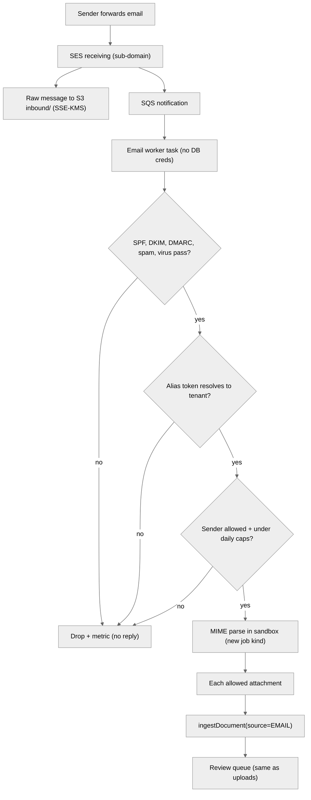

# Email-forward ingestion (design only)

> **Status: DESIGN ONLY. Not implemented.** This is a design-only document. No code, no
> infrastructure and no AWS resources for email ingestion exist in this repository. There is no SES
> receipt rule, no SQS queue, no inbound bucket prefix and no email worker. `infra/` contains no SES,
> SQS or SNS resource on purpose, and an acceptance check asserts that. The web platform sends no
> email of any kind, and this design never adds outbound email (no auto-replies, ever).
>
> Written by scriber for run `REQ-20261008-step3-import-export` (build-order step 3) from spec Part E.
> Pre-product, synthetic data only.

## 1. Goal

Customers forward carrier invoices, rate confirmations and bills of lading to a per-tenant address.
The attachments then enter the **same** import pipeline as a browser upload. They are sniffed, stored
encrypted, parsed in the sandbox, extracted with provenance and placed in the human review queue.
Nothing from an email becomes a claim without a reviewer accepting the document. That is the same
gate as for uploads.

## 2. What step 3 already built for it (schema hooks only)

| Hook | Where | Purpose |
| --- | --- | --- |
| `ImportSource { UPLOAD EMAIL }` | `import_batches.source`, `import_documents.source` | marks the origin of a batch or document |
| `import_documents.source_ref` | migration `20261009000000_import_export` | reserved for `sha256(Message-ID)` so the same message is never imported twice |
| `import_documents.uploaded_by_id` nullable | same | an email document has no uploading user |
| `ingestDocument(...)` and its `IngestActor` union | `api/src/imports/service.ts`, `api/src/imports/deps.ts` | `actor` is `{kind:'user', ...}` or `{kind:'system', name}`; the email worker would use a system actor |

Nothing else exists. In particular, the API has no route that accepts email, and no code reads MIME.

## 3. Proposed flow

1. **Receiving.** Amazon SES receives mail on a dedicated sub-domain, for example
   `inbound.<product-domain>`. A receipt rule stores the raw message in a **separate, private,
   SSE-KMS-encrypted** bucket prefix `inbound/`. It does not use the documents prefix `t/`. The rule
   then publishes a notification to SQS.
2. **Email worker.** A separate, low-privilege ECS task consumes the queue. It has **no database
   credentials**. It can read `inbound/` and call one internal submission path. Its task role cannot
   reach tenant documents.
3. **Verdicts.** The worker requires the SES verdicts to pass: SPF, DKIM, DMARC, spam and virus. Any
   failure drops the message, with a metric and a log line that names fixed codes only.
4. **Tenant resolution.** Each tenant gets a random alias `docs+<128-bit token>@inbound.<domain>`. Only
   a hash of the token is stored. The token can be rotated and revoked from tenant settings. An
   optional per-tenant sender allow-list (addresses or domains) applies on top. An unknown, revoked
   or disallowed alias drops the message silently, so the system is not an oracle for valid aliases.
5. **MIME parsing in the sandbox.** MIME is hostile input. It is parsed inside the same sandbox executor
   as documents (`ParseExecutor`, new job kind), never in the worker's main process. Limits: nesting
   depth 5, 20 parts, 10 MiB per attachment, 25 MiB per message. The HTML body and inline images are
   ignored. TNEF (`winmail.dat`), nested `.eml`/`message/rfc822` parts, archives (zip, rar, 7z, gz) and
   executables are rejected.
6. **Submission.** Each allowed attachment goes through the **same** `ingestDocument` pipeline as an
   upload. Sniffing, the type allow-list, size limits, quota, SSE-KMS storage, sandboxed parsing,
   extraction and review all apply unchanged. The call uses `source=EMAIL`,
   `source_ref = sha256(Message-ID)` (deduplication), a system actor, and an audit event for every
   step. One email becomes one import batch.
7. **Caps.** Per-tenant daily caps on message count and bytes. Excess messages are dropped and counted.
8. **No outbound email.** No bounce, auto-reply, confirmation or read receipt is ever sent. Senders see
   the result only in the web app.

## 4. Security notes

- The raw message prefix is separate from tenant documents. It has its own lifecycle (see open question
  3) and only the email worker may read it.
- Because the worker has no database credentials, a compromised MIME parser cannot query tenant data.
  The worker can only submit documents for the tenant the alias resolved to.
- The alias token is a bearer secret. Anyone who learns it can submit documents into that tenant's
  review queue. They cannot read anything, and nothing becomes a claim without review. Rotation and
  revocation are the mitigation.
- Email bodies are not imported (see open question 2). Headers and bodies are never logged.
- SES virus scanning is not a full anti-malware control. The same "no AV scan" residual risk as for
  uploads applies (see [technical/web-platform-security.md](../../technical/web-platform-security.md)).

## 5. Open questions for the owner

1. **Inbound domain and AWS region.** Which sub-domain receives mail, and in which SES receiving
   region? SES inbound is available only in some regions, and the choice affects data residency.
2. **Body text.** May the plain-text body of an email be imported as a document, for example when a
   carrier pastes the invoice into the message? The default in this design is **no**: attachments only.
3. **Retention of raw messages.** How long are raw messages kept in `inbound/`? The suggestion is
   **14 days**, then deletion by an S3 lifecycle rule. Imported attachments follow the normal document
   retention.

## 6. Out of scope

Outbound email of any kind, replies to senders, OCR of image attachments (images are stored and
flagged for manual entry, as with uploads: divergence D8), and any AI or LLM processing of email content.
